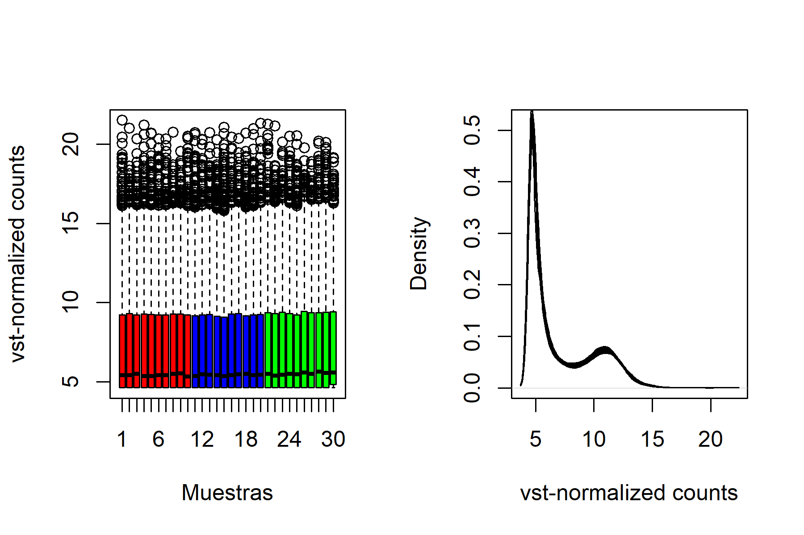
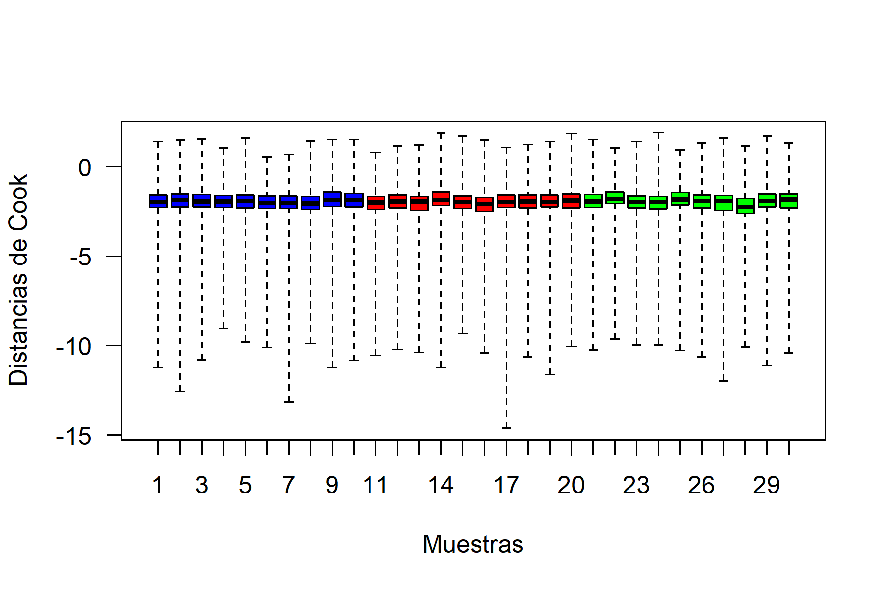
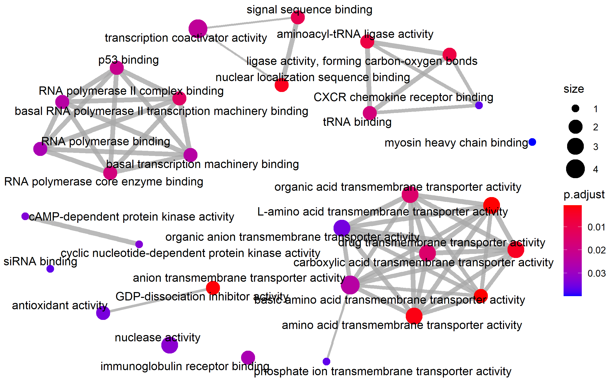
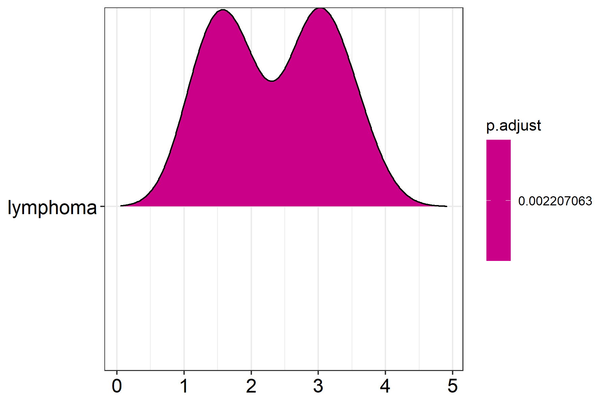

```{r setup, include=FALSE}
knitr::opts_chunk$set(echo = T)
library(knitr)
library(kableExtra)
library(dplyr)
library(BiocGenerics)
library(DESeq2)
```

\newpage

# 1. Abstract

En este estudio se identifican las redes biológicas afectadas por el tamaño de infiltración cancerígena en muestras de tiroides de pacientes humanos. Los datos se obtienen de la base de datos GTEx y corresponden a análisis de RNA-Seq. Tras el análisis de expresión diferencial utilizando `DESeq` en `R` y la anotación de los tránscripts de interés, se identifican varios términos GO y rutas biológicas KEGG que podrían informar de los cambios biológicos según el tipo de infiltración del tejido.

**Los datos y scripts utilizados para el análisis pueden encontrarse en un repositorio `GitHub`, acesible aquí: [https://github.com/marcexpositg/exposit_marc_ADO_PEC2_MBio](https://github.com/marcexpositg/exposit_marc_ADO_PEC2_MBio)**


# 2. Objetivos

**El estudio:** el objetivo del estudio es estudiar cambios en la expresión génica de tejido de tiroides humano según el tamaño de infiltraciones cancerígenas. Para ello, se parte de 10 muestras de cada uno de los 3 tamaños distintos de infiltraciones (sin infiltración, NIT; focal, SFI; o extensa, ELI), selecionadas aleatoriamente de un conjunto de 292 muestras.

**La pregunta a responder:** identificar los procesos biológicos afectados según el tamaño de infiltraciones cancerígenas en tejido humano de tiroides, a partir de la comparación del nivel de expresión de los genes.

**El método:** la expresión génica de cada muestra se analiza por RNA-Seq para poder realizar un análisis de expresión diferencial utilizando `R`. La identificación de genes con cambio de expresión se realiza a partir de tres comparaciones a pares distintas entre los 3 niveles de tamaño de infilitración.

# 3. Materiales y métodos

## 3.1. Descripción de los datos

Los datos utilizados para el estudio se obtienen a partir del repositorio del proyecto *Gentoype-Tissue Expression* (GTEx)[@lonsdale2013genotype], que contiene datos de RNA-Seq y *Whole Genome Sequencing* de distintos tipos de tejido de casi 1000 individuos humanos. En este caso, se parte de 292 muestras con datos de expresión de **RNA-Seq** para 56202 tránscritos. Estos pertenecen a tejido de **tiroides** humana y las muestras se clasifican según el tamaño de infiltración cancerígena del tejido:

- Sin infiltración (*Not infiltrated tissues*, NIT): 236 muestras
- Infiltraciones pequeñas y focales (*Small focal infiltrates*, SFI): 42 muestras
- Infiltraciones limfóides extensas (*Extensive lymphoid infiltrates*, ELI): 14 muestras

Para realizar el análisis de expresión diferencial, se selecionan aleatoriamente 10 muestras de cada tipo de infiltración para teber el mismo número de muestras de cada tipo. El efecto biológico a estudiar se asesora a partir de **tres comparaciones a pares**: SFI-NIT, ELI-NIT, y ELI-SFI. Ya que el tamaño de infiltración ordena las tres categorías (NIT<SFI<ELI), a través de estas comparaciones se comparan los dos niveles de infiltración (pequeña, SFI; o grande, ELI) con tejido sin infiltrar (NIT), y los dos niveles de infiltración entre ellos (SFI-ELI). De este modo se puede caracterizar la muestra correctamente.

Por lo tanto, el diseño experimental corresponde a un solo factor (tamaño de la infiltración) estudiado a tres niveles distintos utilizando 10 réplicas para cada nivel. Así pues, el total de muestras utilizado es de 30.

## 3.2. Pipeline de análisis

Brevemente, el estudio parte de una matriz de contajes que indica, para cada una de las 292 muestras disponibles, el número de *reads* o contajes que se ha realizado para cada uno de los 56202 tránscrits analizados por RNA-Seq. Por lo tanto, no se empieza a partir de la *raw data* (que serían los ficheros `FASTQ`) y se supone que los datos en bruto han sido analizados para filtrar por calidad (quizás con `FastQC`) y mapeados a los tránscritos para obtener la matriz de contajes inicial (quizás con `tximport` y `Salmon`). Junto con la matriz de datos, se proporciona información de las muestras para categorizarlas según el tipo de infiltración. Después de selecionar 10 muestras aleatoriamente de cada clase, se filtran los datos iniciales reduciendo el número de genes a comparar para disminuir el error de tipo 1 de los contrastes.

Con los datos iniciales preparados, se ha realizado un análisis exporatorio inicial de los datos. Para ello, se crean gráficos de la distribución de contajes de cada muestra, matrices de similitud entre las muestras, y se realiza el análisis de componentes principales (PCA) para identificar el orígen de la varianza entre las muestras.

El análisis de expresión diferencial se realiza para las tres comparaciones utilizando las funciones de la liberería `DeSeq2` dentro de `Bioconductor` en `R`. Para la interpretación de los resultados, se han anotado los tránscritos con las IDs de Entrez y el nombre del gen al que pertenecen, utilizando la librería `org.Hs.eg.db` de `AnnotationDbi`. Con los tránscripts anotados, se crean tablas para mostrar los genes que se encuentran más diferencialmente expresados en cada una de las tres comparaciones. También se utilizan gráficos como los gráficos MA o *Volcano Plots* para mostrar la distribución de los tránscritos según las condiciones.

Para entender bien la cuestión del estudio, se han comparado los 3 contrastes entre ellos. Esto permite identificar aquellos genes cuya expresión cambia en todas las muestras, solamente en una o en dos de ellas, y crear grupos de interés para estudiar con más detalle. Para esto, se han utilizado diagramas de Venn y *heatmaps*.

Finalmente, a partir de los genes que se hallan diferencialmente expresados en uno de los grupos anteriores, se ha utilizado `clustrProfilr` para anotar los términos GO que se encuentran diferencialmente expresados y las vías metabolicas en las que están implicados, junto con una visualización de como cambia una de estas redes. El análisis de *Gene Enrichment* permite dotar de sentido biológico al análisis realizado con RNA-Seq y entender las diferencias entre los grupos para resolver las questiones planteadas.

## 3.3. Preparación de los datos

### 3.3.1. Importación de datos

Los datos iniciales constan de una matriz de contajes (*counts*) y una matriz de información de las muestras en formato `csv`. Para selecionar 10 muestras de cada clase, se descarta selecionar aleatoriamente las columnas y filas de estas matrices por separado y luego juntarlas en un objeto `SummarizedExperiment`, ya que hay mayor riesgo de equivocación que en la aproximación descrita a continuación. Por esto, se construye primero el objeto `SummarizedExperiment`[@morgan2017summarizedexperiment] a partir de las dos matrices. Este objeto es estándard  y puede ser utilizado por varias librerías y por varios tipos de datos, y guarda información que relaciona cada muestra con su información y los counts de los genes. De este modo, se puede obtener un `subset` a partir de este objeto sin riesgo a cruzar muestras involuntariamente.

La seleción de 10 muestras de cada clase se realiza aleatoriamente utilizando la semilla 456, y utilizando la función `sample` para elegir entre los índices de cada categoría. Estos índices se utilizan para seleccionar 10 muestras de cada grupo del objeto `SummarizedExperiment` y mantenerlas en un mismo objeto.

Una vez el conjunto de datos a analizar está definido se crea un objeto `DESeqDataSet` a partir del `SummarizedExperiment`. Nótese que en este paso se **reordenan los factores** de `Group` que indica el tipo de infiltración, de modo que `NIT` sea el grupo basal con el que realizar las comparaciones, `SFI` el nivel medio y `ELI` el nivel alto. También se especifica **el diseño del experimento** que tendrá en cuenta solamente una variable, que es el tipo de infiltración (`Group`). Con `DESeq2` no es necesario crear una matriz experimental como pasa con `limma`, solamente debe especificarse `design = ~ Group` en este caso y asegurarse que el orden de los factores es correcto.

### 3.3.2. Filtraje inicial

Previamente a realizar los contrastes para identificar los genes expresados diferencialmente, se filtran los datos. El proceso de filtraje tiene por objetivo reducir el número de genes contrastados estadísticamente, ya que el error de tipo I incrementa al realizar un número elevado de comparaciones. Elegir el punto límite de filtraje es delicado, ya que si se eliminaran demasiados genes podrían perderse efectos importantes en el análisis. Por este motivo, se prueba de aplicar distintos filtros para ver como cambia el número de muestras estudiadas.

Un filtrado básico es eliminar aquellos genes cuyos tránscritos no se han identificado o se han identificado una sola vez en las 30 muestras comparadas (aquellos genes con `counts=0` o `counts=1`). Estos genes no aportan información y eliminandolos se disminuye el número de comparaciones realizadas, reduciendo el error de tipo I. Para probar, también se crea un filtrado más *agresivo*, que descartaría aquellos genes que no lleguen a 5 counts en almenos 10 muestras de las comparadas. Del total de 56202 tránscripts estudiados, el filtrado básico elimina 9950 tránscripts con `count=0` y 2890 con `count=1`. El filtrado más estricto eliminaría 25229 tránscripts del conjunto (cerca del $50\%$ de los datos). 

En este caso, se toma **la decisión de mantener el filtro básico y descartar aplicar un filtro que eliminaría el** $50\%$ **de los datos**. Seguramente, la información sobre el experimento y las preguntas a responder permitiría saber si es preferible el error introducido al comparar un elevado número de muestras o bien es preferible estudiar el mayor número de genes posibles porqué es posible que haya interacciones. Como no se dispone de esta información, se decide **escoger la opción más conservativa** y con menos riesgo de perder información. Aún así, el filtraje realizado ya avanza que un gran número de los genes estudiados (cerca del $50\%$) tiene un número de `counts` bajo (no llega ni a 5 counts en 10 de las muestras). Otro motivo por el que se ha optado por un filtro suave es porqué al realizar el análisis de expresión diferencial con `DESeq` esta función ya realiza un filtrado simple. Tras el filtrado básico, el conjunto de datos pasa de **56202 tránscripts a 43362**, conservando el $77\%$ de los datos.

### 3.3.1. Normalización y análisis descriptivo

Para la exploración de datos multivariantes es importante asegurar la homocedasticidad de los datos, es decir, que la varianza sea constante independentmente de la media de las muestras. En el caso de los datos de RNA-seq, la varianza incrementa con la media de cada muestra. Así, para realizar análisis multivariantes con datos de RNA-Seq se ha aplicado un proceso de normalización entre muestras que permita las comparaciones.

Esta normalización se fundamenta en tomar el logaritmo de base 2 (`log2`) de los *counts* al que se añade un pseudo-contaje de 1 para evitar el caso $log_2(0)=-\infty$. Aún así, esto incrementa el peso que tienen los datos con bajos valores de *counts* en estos análisis multivariantes. Estos datos son precisamente aquellos con menos separación entre señal y ruido y por lo tanto, podrían introduir ruido en el análisis. Para solucionarlo, el paquete `DESeq` introduce dos posibles transformaciones: la *variance stabilizing transformation* (VST) y la*regularized-logarithm transformation* (rlog).

Las dos transformaciones son prácticamente idénticas al `log2` para valores altos, pero difieren en como tratan los valores pequeños. Para muestras de tamaño medio y grande (n>=30) es más adecuado utilizar `VST`[@zhu2019heavy] ya que es más eficiente que `rlog`, además es menos sensible a outliers de valores altos. **Como en este caso hay 30 muestras, se utiliza la transformación VST**, implementada con la función `vst`.

Con los datos normalizados se visualiza la distribución de los `counts` con un diagrama de cajas y un gráfico de densidad utilizando las funciones gráficas base de `R`. Las distancias entre las muestras se representan utilizando `pheatmap`, que crea un mapa de intensidades de color (*heatmap*) y ajunta las muestras por clústers para su comparación. Finalmente, se analiza la variabilidad de los datos con un *Principal Component Analysis* (PCA) con `plotPCA` y se presentan los resultados con `ggplot`, representando las muestras en sus primeras dos dimensiones de mayor varianza e identificándolas según el tipo de infiltración y sexo del individuo.

## 3.4. Identificación de genes expresados diferencialmente

### 3.4.1. Análisis de expresión diferencial

Para el análisis de expresión diferencial se escoje utilizar la librería `DESeq2`[@love2015rna] en `R` por su versatibilidad, abundancia de funciones que permiten analizar los resultados, y buena calidad de documentación en la red. El análisis se realiza con los *counts* sin normalizar por VST, ya que `DESeq` tiene en cuenta el tamaño de cada muestra para normalizar los datos antes del análisis de forma automática. Además, no es necesario volver a especificar la fórmula de diseño, puesto que ya se ha indicado al crear el objeto `DESeqDataSet` con los datos para el análisis.

Durante el análisis también se calculan las distancias de Cook, con las que se representan los datos para identificar posibles outliers. Finalmente, se extraen los resultados con la función `results` indicando los tres contrastes a realizar (según `Group`: SFI-NIT, ELI-NIT, ELI-SFI). Las tablas resultantes contienen información como el log2FoldChange, que indica el sentido (sobre- o infra- expresado) y magnitud del efecto de cada tránscript en la comparación, y también el *p-valor* sin ajustar y ajustado por Benjamini-Hochberg (BH). En adelante, solamente se utiliza el *p-valor* ajustado por BH, puesto que la correción reducie el error de tipo I introducido al hacer un número tan alto de contrastes, reduciendo así la proporción de falsos positivos.

En este estudio, se considera un gen como interesante de estudio o significante  aceptando un *False Discovery Rate* (FDR) del $10\%$, así que se consideran significativos aquellos que tienen un *p-valor* ajustado por Benjamini-Hochberg **inferior a 0.1**. En análisis de expresión diferencial también se suele aplicar un mínimo de magnitud de efecto necesaria para considerar un gen significante (por ejemplo, `log2FC>1` indicando que la expresión es el doble en una muestra que en la otra). En este estudio, en cambio, se estudian todos aquellos los genes cuyo `FoldChange` es diferente a cero para no perder genes que quizás son importantes aunque su magnitud de cambio sea pequeña.

### 3.4.2. Anotación de los resultados

Para indentificar los tránscripts estudiados se parte del `Ensembl gene ID` que se muestra para cada uno de los tránscripts. Este se formatea para eliminar la versión indicada para cada ID con un `.#` detrás del ID. Para las anotaciones se utiliza el paquete `org.Hs.eg.db` de anotaciones Ensembl de Bioconductor. Para relacionar el código de cada transcript con el resto de los datos se utiliza la función `mapIds`. La información obtenida de cada tránscript es el nombre corto del gen (`symbol`), su `EntrezID` y el nombre completo del gen al que pertenece el transcript. Un total de 20860 tránscripts (cerca de la mitad del total) no pueden ser relacionados por esta base de datos porqué no todos aparecen en la base de datos. Con los tránscripts anotados, se crean tablas para mostrar los 6 tránscritos más sobre- y infra- regulados de cada grupo con mayor cambio de regulación (mayor log2FoldChange) y significancia al $10\%$. Gracias a la anotación, se puede añadir para cada tránscrito información como el log2FoldChange (efecto del gen), el p-valor ajustado (padj), el nombre abreviado del gen al que pertenece y su entrez ID.

### 3.4.3. Visualización

Los resultados del análisis de expresión diferencial se visualizan con gráficos MA utilizando las funciones `lfcShrink` y `plotMA` de la librería `apeglm` para cada comparación[@love2019analyzing]. Para los genes de interés, se puede visualizar el número de counts en cada muestra según el nivel utilizando `plotCounts`. Además, los resultados del análisis de expresión diferencial permiten agrupar los tránscritos según su valor en cada muestra en función del grupo, para visualizar relaciones interesantes. De forma similar a como se hizo para agrupar las muestras según sus varianzas, se pueden agrupar las muestras y sus genes expresados diferencialmente. Para ello, se seleccionan los 20 genes con más expresión diferencial entre las muestras estudiadas y se representan por grupos utilizando `pheatmap`[@phipson2016]. Nótese que se trabaja con los datos normalizados por VST. Finalmente, pueden representarse los datos en un *Volcano Plot*. En este se muestra su `log2FoldChange` que indica el nivel del efecto y si es sobre- o infra- expresión y su *p-valor* ajustado que indica la significancia de este cambio. Como ejemplo se representan los tránscripts de la comparación ELI-NIT, indicando aquellos con cambio significativo (p-valor ajustado<0.1) en color azul y añadiendo el nombre de los 5 tránscripts con un menor p-valor.

## 3.5. Comparaciones múltiples

Para identificar los grupos de genes que se encuentren diferencialmente expresados en más de una comparación y obtener una imagen completa de los datos se utiliza un diagrama de Venn. Para ello, se construye *manualmente* una matriz que indica si un gen es significativo al $10\%$ y sobre-expresado (+1) o infra-expresado (-1) o bien si no es significativo y/o expresado diferencialmente (0), para cada comparación. Esta matriz se adapta al formato de entrada que espera la función `vennDiagram` del paquete `limma`, así que esta se utiliza para representar el diagrama de Venn. Además, a partir de la matriz con los datos del diagrama pueden selecionarse los tránscripts que pertenezcan a una clase concreta (por ejemplo, sobre-expresados tanto en SFI-NIT como en ELI-NIT), y utilizar la función `plotCounts` para visualizar el número de *counts* en cada muestra según el nivel.

## 3.6. Análisis de significación biológica

El análisis de significación biológica consta en relacionar los genes expresados diferencialmente con los términos GO que aportan información biológica sobre cada uno de ellos. Para ello, se utilizan varias funciones del paquete `clusterProfiler`[@yu2012clusterprofiler, @yu2012statistical]. Primero, se obtienen listas de los términos GO associados a los genes expresados diferencialmente a partir de su `EntrezID` utilizando `enrichGO`, y se muestran en tablas y representan utilizando `dotplot`. Gracias a la versatilidad de `clusterProfiler` esta misma información se puede representar de varias formas, incluyendo una red que muestre las relaciones entre estos términos GO con `emapplot`. La función `groupGO` se utiliza para extraer los términos GO de una clase concreta (en este caso la clase `Biological Process` (BP) al nivel 2).

Para el *Gene Enrichment Analysis* se valoran los términos GO según si aparecen más o menos en la comparación entre grupos. Para esta sección solamente se muestran los resultados de la comparación ELI-SFI. Para ello, se construyen vectores con la lista de genes significativos, pero se incluye también como información el `log2FoldChange`. Nótese que se eliminan los `NA` y los `ENTREZID` duplicados (solamente hay 2). Se utiliza la función `gseGO`[@hanzelmann2013gsva] para realizar el análisis de términos GO tiniendo en cuenta la expresión diferencial de genes. La representación se realiza también con `dotplot` pero esta vez tiniendo en cuenta si el término GO se encuentra sobre- o infra- representado en la comparación. A partir de los mismos datos, `gseNCG` permite obtener una representación de los tejidos relacionados con los términos GO de los genes expresados diferencialmente. Finalmente, la función `gseKEGG` aporta información sobre las vias metabólicas afectadas por el cambio de nivel de expresión de los genes expresados diferencialmente. Además, tiene en cuenta si hay sobre- o infra- expresión de estos genes para predecir si la via se encuentra activada o inhibida y en qué puntos. Para visualizar una red metabólica afectada se utiliza la librería `pathway` seleccionado como ejemplo la vía *Natural killer cell mediated cytotoxicity* con KEGG ID `hsa04650`.

\newpage

# 4. Resultados

## 4.1. Preparación y análisis descriptivo de los datos

### 4.1.1. Selección de muestras

Los datos constan del análisis del nivel de expresión de 56202 tránscripts de genes humanos en 292 muestras de tiroides mediante *RNA-seq*. Las muestras se dividen en 3 tipos de infiltración cancerígena (NIT, SFI y ELI). Para el análisis se toman 10 muestras de cada grupo aleatoriamente, que se muestran a continuación (Tabla 1). El nombre resumido de cada muestra incluye el identificador del grupo al que pertenece la muestra, con lo que se comprueba que cada uno de los grupos contiene 10 muestras del grupo correspondiente. Por lo tanto, la obtención del *subset*  de los datos ha sido efectiva.

```{r echo=F, warning=F, message=F}
load(file=file.path("./results/1.Filtraje","SampInf.RDa"))
kable(table_ids, col.names=c("ID de las muestras"),
             caption="Muestras utilizadas para el análisis según su infiltración.", format="latex", booktabs=TRUE) %>% 
  kable_styling(latex_options=c("scale_down", "hold_position"))
```

### 4.1.2. Filtraje

El número de falsos positivos (error de tipo I) en la identificación de genes diferencialmente expresados incrementa con el número de contrastes a realizar. Para reducir este error, se pueden eliminar del conjunto de datos aquellos tránscripts que no aporten información valuosa para el análisis. Elegir el punto de corte entre aquellos genes que deberían mantenerse y aquellos que pueden eliminarse depende de las consideraciones del estudio. Por esto, se ha probado de aplicar dos filtros distintos, uno más básico o conservativo y otro más extenso o agresivo.

El filtro básico se centra en eliminar todos aquellos tránscripts que tienen un número de contajes entre todas las muestras de 0 o 1, ya que no aportan ninguna información que los permita contrastar y por lo tanto pueden ser eliminados sin perder la información. El filtro extenso elimina aquellos tránscripts que no llegan a 5 *counts* en un mínimo de 10 muestras.

Para elegir el filtro a aplicar se representa la distribución del número de *counts* de cada tránscript en cada muestra mediante diagramas de cajas (Figura \ref{fig:Fig1}) y curvas de densidad 
(Figura \ref{fig:Fig2}). Nótese que en las curvas de densidad es imposible observar una línea por cada muestra pese a que están representadas todas individualmente, lo que indica que todas las muestras siguen una distribución parecida (también se puede ver por su similitud en los diagramas de caja). Al comparar los diagramas de barras entre distintos filtros aplicados a la muestra se puede ver que el número de outliers disminuye al aplicar filtrados más extensos, así como la media incrementa. Con los gráficos de distribución puede verse claramente dos picos en la distribución de *counts*, uno entre 0 y 7 y otro pico más ancho cerca de 13. Al aplicar filtros más agresivos disminuye el pico para los tránscripts con bajo número de *counts*. Esto confirma que los filtros eliminan solamente aquellos tránscripts que no aportarían mucha información en el contraste.

```{r Fig1, echo=F, out.width="80%",fig.hold='hold', fig.align='center', fig.cap="Diagrama de cajas de los contajes de los tránscripts según el filtro aplicado a los datos."}

```

```{r Fig2, echo=F, out.width="80%",fig.hold='hold', fig.align='center', fig.cap="Gráfico de densidad de los contajes de los tránscripts según el filtro aplicado a los datos."}

```

Aunque a priori el filtro agresivo conserva los datos que podrían ser interesantes, sin disponer de más detalles biológicos sobre el estudio (que podrían indicar que los cambios pequeños entre genes pueden, o no, ser relevantes) se prefiere optar por la opción conservadora. Por esto, se elige **un filtro que elimine aquellos tránscripts que no tienen suficiente información para los contrastes**, es decir, aquellos que no se han observado en los datos de las muestras o observado una sola vez (insuficiente para hacer una comparación). Tras el filtrado básico, el conjunto de datos pasa de **56202 tránscripts a 43362**, conservando el $77\%$ de los datos.

### 4.1.3. Análisis exploratorio

Antes de proceder con la identificación de los genes expresados diferencialmente, puede estudiarse la naturaleza de los datos y las muestras a través de un análisis descriptivo de estas. Para esto, se normaliza el número de *counts* por el método VST, que es más eficiente que `rlog` cuando hay varias decenas de muestras (y en este caso, `n=30`). Para empezar, se representa la distribución de los *counts* según la muestra con diagramas de cajas y gráfico de densidad (Figura \ref{fig:Fig3}). Las medias y quantiles representados en el diagrama de cajas son parecidas para todas las muestras, y la distribución del gráfico de densidad es prácticamente identica para todas las muestras, hasta el punto que es imposible distinguir la línea para cada muestra. Por lo tanto, la composición de las muestras es similar y se pueden comparar bien con el análisis de expresión diferencial.

```{r Fig3, echo=F, out.width="80%",fig.hold='hold', fig.align='center', fig.cap="Diagrama de cajas (izquierda) y gráfico de densidad (derecha) de los contajes de cada tránscript normalizados por VST según la muestra. En el diagrama de cajas, las muestras rojas son del grupo NIT, las azules de SFI y las verdes de ELI. "}

```

A continuación, se calculan las distancias entre las muestras según el número de *counts* de los tránscripts y se representan con un gráfico de intensidades (*heatmap*). Las muestras más similares o menos distantes (color más intenso) son aquellas cuyos mismo tránscripts tienen un valor similar de *counts*, mientras que aquellas más distantes (color menos intenso) son aquellas cuyos tránscripts más difieren en el número de *counts*. Además, las muestras se ordenan según similitud formando clústers (Figura \ref{fig:Fig4}). Si la única variabilidad entre las muestras fuera dada por el tipo de infiltración o grupo (NTI/SFI/ELI), entonces se observarían 3 grupos con las 10 muestras correspondientes al mismo tipo. Aún así, en el gráfico se puede observar que todos los grupos se mezclan entre ellos, almenos en parte. El grupo que menos se mezcla es el grupo `ELI`, mientras que las muestras de `NIT` y `SFI` se encuentran mezcladas en gran parte. Esto indica que hay muestras de grupos distintos que son más parecidas entre ellas que con muestras de su mismo grupo. La causa podría ser otro factor de variabilidad de los datos. Aún así, esto no indica que no se pueda realizar el análisis de expresión diferencial correctamente, ya que al disponer de 10 muestras de cada grupo es posible que se puedan identificar patrones de expresión comunes y característicos de grupo.

```{r Fig4, echo=F, out.width="80%",fig.hold='hold', fig.align='center', fig.cap="Matriz de distancias entre las muestras, agrupadas por su similitud. Menor distancia se representa con un azul más oscuro."}

```

Para profundizar en los factores que podrían causar las diferencias entre las muestras observadas en el gráfico de similitudes anteriores, se realiza un análisis de componentes principales (PCA). Los resultados se representan teniendo en cuenta el grupo (tipo de infiltración) y sexo del individuo (Figura \ref{fig:Fig5}). Se puede ver que la componente principal (el factor que explica mayor parte de la varianza) explica hasta el $60\%$ de varianza de los datos, mientras que la segunda componente explica tan solo el $10\%$ de la varianza.

Al observar la disposición de las muestras en el eje horizontal y según su color que indica el tipo de infiltración, se puede ver un paralelismo con los resultados de la matriz de similitudes. Los datos se distribuyen según el grupo a lo largo del eje horizontal y siguiendo el órden esperado por el tamaño de las infiltraciones (infiltraciones NIT en un extremo, ELI en el otro y SFI en el medio). Pese a que esta distribución presenta algunas excepciones, se podría decir que la primera componente de la varianza se debe al factor del tipo de infilitración, con lo que los contrastes planteados seguramente permitirán observar distintos genes enriquidos según el grupo de infiltración.

En el eje vertical, los datos se distribuyen según el sexo del individuo. Por lo tanto, la segunda componente se identifica con el sexo. Como la segunda componente tan solo explica el $10\%$ de la varianza, el análisis de los datos se puede realizar teniendo en cuenta solamente el factor tipo de infiltración, ya que el resto de factores explicaría menos del $10\%$ de la varianza. Así pues, el diseño experimental tenido en cuenta para en análisis será de solo un factor con tres niveles.

```{r Fig5, echo=F, out.width="80%",fig.hold='hold', fig.align='center', fig.cap="Muestras representadas según las dimensiones 1 y 2 de las componentes principales que explican su varianza. La forma de la muestra indica el sexo del individuo y el color el tipo de infiltración."}

```

\newpage

## 4.2. Identificación de genes expresados diferencialmente

### 4.2.1. Análisis de expresión diferencial

Para entender biológicamente los tipos de infilitración se deben identificar aquellos genes que se expresan de forma diferencial entre los tipos de infilitración. El estudio tiene un solo factor con tres niveles, así que se pueden hacer 3 comparaciones a pares distintas. Para las comparaciones se tiene en cuenta que los factores están ordenados según el tamaño de la infiltración. Por lo tanto, el nivel bajo corresponde a NIT (la clase sin infiltración), el nivel medio a SFI (infiltración pequeña), y el nivel alto a ELI (infiltración extensa). Así pues, se definen tres contrastes:

- SFI-NIT: Nivel medio vs. nivel bajo.
- ELI-NIT: Nivel alto vs. nivel bajo.
- ELI-SFI: Nivel alto vs. nivel medio

En los tres contrastes, el nivel más alto siempre está como nivel superior, así que los genes sobre-expresados serán aquellos cuya expresión incrementa con el tamaño de la infiltración, y los infra-expresados serán aquellos cuya expresión disminuye con el tamaño de la infiltración. El órden de los factores se tiene en cuenta al realizar el análisis de los datos de *RNA-Seq* con `DESeq` para asegurar que los resultados reflejan el objetivo a estudiar.

En el proceso de identificación de los genes expresados diferencialmente se calculan las distancias de Cook entre los *counts*, que se utilizan para ver si hay alguna muestra que sea un *outlier*. Una representación con un diagrama de cajas de las distancias de Cook muestra que ninguna de las muestras es diferente al resto, y por lo tanto, todas 30 muestras se pueden utilizar para la expresión diferencial (Figura \ref{fig:Fig6}).

```{r Fig6, echo=F, out.width="80%",fig.hold='hold', fig.align='center', fig.cap="Diagrama de cajas de las distancias de Cook entre los contajes de los tránscripts de cada muestra según el tipo de infiltración (azul, NIT; rojo, SFI; verde, ELI)."}

```

Las comparaciones entre ELI-NIT y ELI-SFI identifican un número mayor (hasta 1 orden de magnitud mayor) de genes con expresión diferencial (al $90\%$ de nivel de confianza) que la comparación SFI-NIT (Tabla 2). En general, se observan más genes sobre-expresados que infra-expresados en todas las comparaciones. Nótese que para estas comparaciones no se aplica un límite mínimo de efecto (Fold Change) para considerar los genes diferencialmente expresados.

```{r echo=F}
load(file=file.path("./results/3.ExpresionDiferencial","Reslt_summary.Rda"))
kable(tbl,caption="Resultados de la expresión diferencial de genes en cada comparación.", format="latex", booktabs=TRUE)
```

### 4.2.2. Anotación de los resultados

La anotación de los tránscripts solamente identifica cerca de la mitad de los tránscripts, habiendo 20860 tránscripts sin anotar. Por esto, al mostrar los 6 genes con expresión significativa más sobre- e infra-expresados de cada comparación hay múltiples transcripts sin identificación y con `NA` (Tablas 3-8). Aún así, es posible identificar similitudes entre los contrastes. Por ejemplo, las comparaciones entre ELI-NIT y ELI-SFI tienen algunos genes sobre- e infra-expresados en común, indicando que seguramente se tratan de genes sobre-expresados exclusivamente cuando la infiltración es extensa y limofóide.

Precisamente estos términos GO tienen que ver con el sistema immunitario tal y como sugiere el nombre de ELI (extensive lymphoid infiltration), así que gracias a la anotación se pueden sacar ideas sobre lo que pasa biológicamente. Aún así, para comparar los tránscripts más comunes es más apropiado utilizar un diagrama de Venn como se muestra más adelante.

```{r echo=F}
load(file=file.path("./results/3.ExpresionDiferencial","Reslt_SvNDwn.Rda"))
kable(SvNDwn, caption="Genes significativos con mayor infra-expresión del contraste SFI-NIT.", format="latex", booktabs=TRUE) %>% 
  kable_styling(latex_options="scale_down")
load(file=file.path("./results/3.ExpresionDiferencial","Reslt_SvNUp.Rda"))
kable(SvNUp, caption="Genes significativos con mayor sobre-expresión del contraste SFI-NIT.", format="latex", booktabs=TRUE) %>% 
  kable_styling(latex_options="scale_down")
load(file=file.path("./results/3.ExpresionDiferencial","Reslt_EvNDwn.Rda"))
kable(EvNDwn, caption="Genes significativos con mayor infra-expresión del contraste ELI-NIT.", format="latex", booktabs=TRUE) %>% 
  kable_styling(latex_options="scale_down")
load(file=file.path("./results/3.ExpresionDiferencial","Reslt_EvNUp.Rda"))
kable(EvNUp, caption="Genes significativos con mayor sobre-expresión del contraste ELI-NIT.", format="latex", booktabs=TRUE) %>% 
  kable_styling(latex_options="scale_down")
load(file=file.path("./results/3.ExpresionDiferencial","Reslt_EvSDwn.Rda"))
kable(EvSDwn, caption="Genes significativos con mayor infra-expresión del contraste ELI-SFI.", format="latex", booktabs=TRUE) %>% 
  kable_styling(latex_options="scale_down")
load(file=file.path("./results/3.ExpresionDiferencial","Reslt_EvSUp.Rda"))
kable(EvSUp, caption="Genes significativos con mayor sobre-expresión del contraste ELI-SFI.", format="latex", booktabs=TRUE) %>% 
  kable_styling(latex_options="scale_down")
```

### 4.2.3. Representación gráfica

Los *counts* de un tránscript de interés pueden visualizarse en cada muestra clasificada según el tipo de infiltración. Nótese que los *counts* se muestran normalizados con la normalización aplicada automáticamente por `DESeq2` para el contraste. Como ejemplo se han selecionado dos tránscripts de interés, identificados como ENSG00000100721.6 (del gen *T cell leukemia/lymphoma*, TCL1A) y ENSG00000100604.8 (del gen *chromogranin A*, CHGA) y representado el número de *counts*  de cada uno según la muestra (Figura \ref{fig:Fig7}). El primero de estos se encuentra entre los genes más infra-expresados de las comparaciones ELI-NIT y ELI-SFI pero no en la comparación SFI-NIT. El gráfico concuerda con esta información, ya que se vé que los *counts* de este tránscript en las muestras de ELI son más elevadas que en el resto de muestras. Aún así, hay algunas muestras de ELI cuyo valor no es tan alto y los gráficos no permiten saber si esta expresión es significativa, por lo que solamente sirven de soporte para el análisis de expresión diferencial.

En el caso del otro tránscript estudiado, ENSG00000100604.8, se encuentra infra-expresado en los contrastes ELI-NIT y ELI-SFI, pero no entre SFI-NIT. La misma información se puede ver en el gráfico, ya que los counts de NIT y SFI son más elevados que en ELI, por lo que se encuentra infra-expresado en ELI. De nuevo, la dispersión de las muestras es grande entre NIT y SFI y es el contraste estadístico el que indica que este gen es significativamente infra-expresado en ELI.

```{r Fig7, echo=F, out.width="80%",fig.hold='hold', fig.align='center', fig.cap="Contaje de un tránscript sobre-expresado (izquierda) y otro infra-expresado (derecha) en ELI de cada muestra según el tipo de infiltración."}

```

Estos gráficos también pueden crearse para visualizar un conjunto determinado de tránscripts individualmente. A continuación se muestran los 6 tránscripts con mayor sobre-expresión y significativos al $90\%$ de confianza del contraste ELI-NIT (también mostrados en la Tabla 6). En todos los casos se puede ver que los niveles de algunas muestras de ELI son muy elevados mientras que el nivel en NIT es bajo (Figura \ref{fig:Fig8}). Como en este contraste no se tiene en cuenta la muestra SFI, hay algunos tránscripts cuyo nivel en SFI es alto y otros cuyo nivel es bajo.

```{r Fig8, echo=F, out.width="80%",fig.hold='hold', fig.align='center', fig.cap="Contaje de los 6 tránscripts con mayor sobre-expresión en el contraste ELI-NIT de cada muestra según el tipo de infiltración."}

```

Para visualizar las diferencias entre las muestras contrastadas para cada uno de los tránscripts analizados se utilizan gráficos MA. Los tránscripts se distribuyen en el eje horizontal (A) según el valor medio de *counts* del tránscript en el conjunto de las muestras, y en el eje vertical (M) según el efecto (*log fold change*) de este tránscript en el contraste. Como ejemplo, se muestran los gráficos MA de los contrastes SFI-NIT y ELI-NIT para ver como se pueden utilizar para comparar la distribución de las comparaciones (Figuras \ref{fig:Fig9} y \ref{fig:Fig10}).

De entrada, se puede ver que los datos están bien normalizados en las dos muestras porque la mayoría de tránscripts tienen el valor cero en el eje vertical. Esto es así porqué la mayoría de tránscripts no tiene un nivel de expresión diferente entre las muestras y por lo tanto su efecto (*log fold change*) debe ser cero, tal y como se vé en el eje vertical. En los dos gráficos MA se muestra la posición del gen con menor *p-valor* ajustado. En ambos casos, corresponde a un gen sobre-expresado ya que el valor del eje vertical es mayor que cero porqué su efecto (*log fold change*) es positivo. También en ambos casos el gen con mayor *p-valor* ajustado no corresponde al que tiene mayor efecto entre los genes.

Al comparar los gráficos entre los contrastes SFI-NIT y ELI-NIT se puede ver que hay más tránscripts con efecto (que se desvian de *log fold change*=0) entre ELI-NIT que entre SFI-NIT, tal y como se ha podido ver al realizar los contrastes y encontrar un porcentaje mayor de tránscripts expresados con significancia en la comparación ELI-NIT (Tabla 2).

```{r Fig9, echo=F, out.width="80%",fig.hold='hold', fig.align='center', fig.cap="Gráfico MA de la comparación SFI-NIT, mostrando los tránscripts según su efecto (log fold change) y los counts medios (eje horizontal). Los triangulos corresponden a tránscripts fuera del rango del eje vertical. Se muestra la identidad del tránscript con menor p-valor ajustado."}
knitr::include_graphics("results/4.DEAnl/3.MASvN_2.png")
```

```{r Fig10, echo=F, out.width="80%",fig.hold='hold', fig.align='center', fig.cap="Gráfico MA de la comparación ELI-NIT, mostrando los tránscripts según su efecto (log fold change) y los counts medios (eje horizontal). Los triangulos corresponden a tránscripts fuera del rango del eje vertical. Se muestra la identidad del tránscript con menor p-valor ajustado."}

```

Los resultados del análisis de expresión diferencial pueden utilizarse para crear grupos entre los tránscripts con patrones de expresión similar y entre muestras. Para ello, se seleccionan los 20 genes con más expresión diferencial entre las muestras estudiadas y se representan por grupos. Nótese que se utilizan los *counts* normalizados por VST. En el *heatmap* resultante puede verse como se forman grupos entre los tránscripts que siguen un patrón común en varias de las muestras (Figura \ref{fig:Fig11}). En la parte superior se identificada cada muestra según el sexo y el tipo de infiltración. Los grupos creados según el tipo de infiltración contienen desviaciones respeto las identidades de las muestras, seguramente causadas por mirar solamente un conjunto pequeño de genes. Sorprendentemente, hay algunos patrones génicos que parecerían correlacionarse mejor con el sexo que con el tipo de infiltración.

```{r Fig11, echo=F, out.width="80%",fig.hold='hold', fig.align='center', fig.cap="Matriz de intensidades (heatmap) que indica las correlaciones entre la expresión de los 20 tránscripts (eje vertical) con mayor variabilidad entre las muestras (eje horizontal). Se agrupan los tránscripts, y también las muestras según sexo y tipo de infiltración. Cuando mayor sobre-expresión hay entre la comparación mayor es la intensidad del color rojo, mientras que para infra-expresión se utiliza el color azul."}

```

Finalmente, pueden representarse los resultados de expresión diferencial pueden representarse en un *Volcano Plot* para comparación. El *volcano plot* representa los tránscripts según su `log2FoldChange` que indica el nivel y tipo del efecto y según su *p-valor* ajustado que indica la significancia de este cambio. El *volcano plot* de la comparación ELI-NIT muestra una mayor variabilidad en los valores de efecto de los genes sobre-expresados que los infra-expresados (Figura \ref{fig:Fig12}).

```{r Fig12, echo=F, out.width="80%",fig.hold='hold', fig.align='center', fig.cap="Volcano plot de los tránscripts de la comparación ELI-NIT. Se muestra el Ensembl ID de los 4 tránscripts con menor p-valor ajustado. Los tránscripts cuyo p-valor es inferior a 0.1 se muestran de color rojo, así que los tránscripts azules son los tránscripts significantes."}

```

## 4.3. Comparaciones múltiples

Para profundizar en los detalles de los tránscripts de interés es necesario comparar las distintas comparaciones a pares entre ellas. Para ello, se utilizan diagramas de Venn, que muestra el número de genes en común entre los contrastes y según si son sobre- o infra-expresados (Figura \ref{fig:Fig13}). Nótese que se consideran los tránscripts significativos al $90\%$ de nivel de confianza y no hay un límite mínimo de efecto (si `log2FoldChange>0` es sobre-expresado, y si `log2FoldChange<0` es infra-expresado).

El diagrama de Venn muestra patrones interesantes, como que un número elevado de tránscripts ($3247+1296$) presentan una regulación parecida entre las comparaciones ELI-NIT y ELI-SFI. Estos genes en común son aquellos cuya expresión es más elevada o baja en ELI que en el resto de grupos. Hay un número menor de tránscripts ($97$) con el mismo comportamiento entre ELI-NIT y SFI-NIT, que corresponden a aquellos genes que presentan una expresión más elevada o baja tanto en ELI como SFI pero no en NIT. Es logico observar que no hay genes con el mismo patrón de expresión diferencial entre SFI-NIT y ELI-SFI, ya que una de las comparaciones utiliza SFI como nivel alto y la otra como nivel bajo.

```{r Fig13, echo=F, out.width="80%",fig.hold='hold', fig.align='center', fig.cap="Diagrama de Venn que indica el número de tránscripts sobre-expresados (rojo) o infra-expresados (azul) en común entre los contrastes realizados. También se muestra aquellos tránscripts sin cambio de expresión significativa fuera de los círculos."}


```

Finalmente, hay 30 genes que se encuentran sobre-expresados en todas las comparaciones, es decir, cuyo nivel de expresión es significativamente mayor en ELI que en SFI y este es superior que en NIT. Este conjunto de genes son aquellos cuya expresión incrementa significativamente con las categorías y tamaño de infiltración. A partir de la comparación entre las comparaciones se pueden definir conjuntos de tránscripts de interés. Así pues, se puede estudiar con más detalle un grupo concreto, como estos 30 genes sobre-expresados en cada nivel. Un gráfico de *counts* de 6 de los 30 tránscripts de este grupo confirma lo que indica el diagrama de Venn, ya que se puede ver claramente que el nivel de expresión de estos tránscripts incrementa con el tamaño de infiltración (ELI>SFI>NIT) (Figura \ref{fig:Fig14}). Identificar estos genes no hubiera sido posible sin comparar las comparaciones entre ellas.

```{r Fig14, echo=F, out.width="80%",fig.hold='hold', fig.align='center', fig.cap="Cambio del número de counts de 6 de los 30 tránscripts cuya expresión cambia significativamente con cada tipo de infiltración, representados por cada muestra según el tipo de infiltración."}

```

Del mismo modo, puede estudiarse otro conjunto de tránscripts de interés, como los 7 tránscripts infra-expresados en las comparaciones SFI-NIT y ELI-NIT pero no en ELI-SFI. Estos tránscripts son los tránscripts cuya expresión disminuye con la presencia de infiltraciones cancerígenas, ya que su expresión cambia en los dos tipos de infiltraciones al compararlos con las muestras no infiltradas (NIT). Los gráficos de *counts* para estos 7 tránscripts confirman que su nivel de expresión es mayor en la muestra `NIT` que en las otras dos muestras, y efectivamente el nivel de expresión es similar entre ELI y SFI y no aparecen expresados diferencialmente en el contraste ELI-SFI (Figura \ref{fig:Fig15}).

```{r Fig15, echo=F, out.width="80%",fig.hold='hold', fig.align='center', fig.cap="Cambio del número de counts de los 7 tránscripts cuya expresión disminuye significativamente en la presencia de infiltraciones, representados por cada muestra según el tipo de infiltración."}

```

## 4.4. Análisis de significación biológica

El objetivo inicial del estudio es identificar los mecanismos biologicos afectados por el tamaño de la infiltración. Para conseguirlo resulta más útil estudiar como cambian las funciones biológicas que el nivel de tránscripts individuales. Así pues, a partir de las anotaciones de estos tránscripts se puede estudiar el cambio de la representación de los términos GO.

Previamente se ha mostrado los términos GO de los tránscripts con mayor cambio de expresión (Tablas 3-8), pero esto no indica que la función biológica que representan sea la función biológica que más ha variado. Para obtener información de los cambios de funciones biológicas, además de tener en cuenta el nivel del cambio de los tránscripts, se tiene en cuenta el número de tránscripts con una función biologica similar cuya expresión se ve afectada. Por ejemplo, el tránscript con mayor *Fold Change* podría estar relacionado con cierta función `X` pero ser el único, mientras que muchos tránscripts de menor efecto podrían estar relacionados con la función `Y`. En un caso así, es probable que sea la función `Y` la más afectada por el tipo de infiltración. Así pues, en esta sección se considera todo el conjunto de genes significativos (*p-valor* ajustado menor de 0.1, log2FoldChange distinto de cero) para obtener información de las funciones biológicas más afectadas por el tipo de infilitración, y no solamente aquellos con mayor efecto.

Así pues, se obtiene una lista de los 6 términos GO (equivalentes a funciones biologicas) más abundantes en el conjunto de genes significativos de cada comparación (Tablas 9-11). De este modo, se pueden deducir algunas de las funciones biologicas más afectadas por el tipo de infiltración. Nótese que estas funciones se encuentran presentes en cerca de un $10\%$ de los genes con expresión significativa. El nivel de los términos GO en este caso es muy detallado y se puede ver que afectan a funciones biológicas básicas involucradas en la regulación génica y mecanismos celulares.

```{r echo=F}
load(file=file.path("./results/6.GOterms","GO_SvN.Rda"))
knitr::kable(GO_SvN,format="latex",booktabs=TRUE,caption="Términos GO más abundantes entre los genes expresados diferencialmente entre SFI y NIT.")
```

```{r echo=F}
load(file=file.path("./results/6.GOterms","GO_EvN.Rda"))
knitr::kable(GO_EvN,format="latex",booktabs=TRUE,caption="Términos GO más abundantes entre los genes expresados diferencialmente entre ELI y NIT.")
```

```{r echo=F}
load(file=file.path("./results/6.GOterms","GO_EvS.Rda"))
knitr::kable(GO_EvS,format="latex",booktabs=TRUE,caption="Términos GO más abundantes entre los genes expresados diferencialmente entre ELI y SFI.")
```

Los mismos resultados se pueden representar visualmente utilizando las funciones de la liberería `clusterProfiler`. En la representación con puntos de los 30 términos GO más enriquecidos en la comparación ELI-SFI (Figura \ref{fig:Fig16}) puede verse que los primeros corresponden a los mostrados en la tabla (Tabla 11). En la representación gráfica se puede ver la abundancia relativa de las actividades en el eje vertical, con lo que se puede ver que las 10 primeras actividades tienen un valor de abundancia superior que el resto, así proporcionando una idea de la función biológica afectada en esta comparación. Por ejemplo, se ve que muchas de las actividades están relacionadas con la actividad GTPasa.

```{r Fig16, echo=F, out.width="80%",fig.hold='hold', fig.align='center', fig.cap="Términos GO más abundantes entre los genes expresados diferencialmente entre ELI y SFI según su abundáncia y p-valor del enriquecimiento."}

```

Quizás una forma más interesante de interpretar estas relaciones es a través de la formación de redes que muestran la similitud entre diversos términos GO enriquecidos en una comparación, como se muestra a continuación para la comparación SFI-NIT (Figura \ref{fig:Fig17}). Esta figura indica que los términos GO afectados por la presencia de infiltraciones SFI al compararla con muestras sin infiltración (NIT) se podrían agrupar en grupos de actividad similar. El grupo con mayor número de términos GO tiene que ver con cambios en los transportadores de componentes metabolicos, indicando un posible cambio de metabolismo con la aparición de infiltraciónes SFI. Otro grupo prevalente tiene que ver con la actividad de unión de RNA polimerasa, indicando cambios en la expresión génica entre las dos muestras. Es interesante ver que se incluye el término GO con relación a unión a p53, que es un marcador cancerígeno, puesto que se compara una muestra cancerígena (SFI) con una que no lo es (NIT).

```{r Fig17, echo=F, out.width="80%",fig.hold='hold', fig.align='center', fig.cap="Términos GO más abundantes entre los genes expresados diferencialmente entre SFI y NIT, agrupados en redes según su similitud de actividad biológica."}

```

Los términos GO se clasifican a varios niveles. Una clasificación general es si indican un *Biological Process* (BP), una *Molecular Function* (MF), o el *Cellular Component* (CC) con el que están involucrados. Así mismo, hay distintos niveles de detalle. Utilizando estos para filtrar los términos GO de interés, se puede ver que la mayoría de términos GO enriquecidos en el contraste ELI-SFI tienen que ver con cambios metabólicos a distintos niveles (Tabla 12).

```{r echo=F}
load(file=file.path("./results/6.GOterms","GOgseEvS.RDa"))
knitr::kable(GOgseEvS,format="latex",booktabs=TRUE,caption="Términos GO de nivel 2 de Biological Process en la comparación entre ELI y SFI.")
```

En los análisis anteriores solamente se tenía en cuenta la abundancia de los términos GO, pero no la magnitud ni sentido (sobre- o infra- expresión) de su efecto. Esta información se puede incorporar al análisis de significación biologica realizando el *Gene Enrichment Analysis* (GEA). Para simplificar los resultados, se muestran solamente los resultados para la comparación ELI-SFI en adelante. Los resultados del GEA permiten representar las actividades biologicas afectadas en la comparación ELI-SFI según si han sido activadas o suprimidas (Figura \ref{fig:Fig18}). El resultado indica que procesos metabólicos relacionados con el ciclo de Krebs son inhibidos mientras que se activa el sistema immune con la aparición de infiltraciones.

```{r Fig18, echo=F, out.width="80%",fig.hold='hold', fig.align='center', fig.cap="Primeros 30 términos GO más enriquecidos en el contraste ELI-SFI según el efecto."}

```

Incluso es posible obtener información sobre los tejidos afectados por el cambio de expresión. En este caso se observan solamente de `lymphoma`, lo que encaja con que la comparación entre ELI-SFI refleja cambios en la infiltración del limfoma y por lo tanto los genes afectados tienen que ver con el limfoma (Figura \ref{fig:Fig19}).

```{r Fig19, echo=F, out.width="80%",fig.hold='hold', fig.align='center', fig.cap="Distribución de los términos GO afectados significativamente en el contraste ELI-SFI según el tejido que afectan."}

```

Finalmente, tiniendo en cuenta el efecto de cada tránscript, puede visualizarse con detalle las redes biologicas más afectadas al comparar las muestras. Combinando la información de la base de redes biologicas KEGG es posible ver las redes más afectadas por el cambio del tipo de infiltración. Comparando ELI-SFI (Tabla 13) se puede ver que las vías afectadas tienen relación con las el sistema immune.

```{r echo=F}
load(file=file.path("./results/6.GOterms","keggtbl.RDa"))
knitr::kable(keggtbl,format="latex",booktabs=TRUE,caption="Redes biológicas de KEGG más afectadas el comparar las muestrasa ELI y SFI. Se incluye el KEGG ID y nombre completo de cada red, junto con la magnitud de su enriquecimiento.")
```

A partir de la información de las vias biológicas afectadas, se elige visualizar con más detalle la vía *Natural killer cell mediated cytotoxicity* con KEGG ID `hsa04650`. La representación tiene en cuenta si los componentes biológicos involucrados son sobre-expresados (verde) o infra-expresados (rojo), dando una imagen detallada y completa de como se modifica una actividad biológica en concreto. En este caso, hay múltiples componentes de la via que se encuentran sobre-expresados (Figura \ref{fig:Fig20}). Esto permite confirmar que la via de citotoxicidad de las células Natural Killer se estimula al incrementar el tamaño de infiltración de SFI a ELI. De modo similar, se podria identificar al detalle qué funciones biológicas están involucradas con el cambio de tipo de infiltración a partir de los datos obtenidos por *RNA-Seq*.

```{r Fig20, echo=F, out.width="80%",fig.hold='hold', fig.align='center', fig.cap="Cambios en los componentes biológicos implicados en la citotoxicidad de las células natural killer (KEGG ID: hsa04650) al comparar muestras ELI y SFI. Los componentes de color verde son sobre-expresados en ELI, mientras que los componentes rojos son infra-expresados. "}

```

\newpage

# 5. Discusión

Los datos de *RNA-Seq* de las muestras analizadas han permitido obtener varios tránscripts con expresión diferencial entre los tipos de infiltración comparados. A partir de la anotación de estos tránscripts, se han obtenido distintas funciones biológicas que podrían estar afectadas por el cambio de tipo de infiltración. En general, los resultados concuerdan con lo que se esperaría a priori, ya que se observa cierta tendencia a cambiar el metabolismo y activar la respuesta immune al incrementar el tamaño de infiltración cancerígena.

Aún así, hay varios factores que es importante destacar que quizás han afectado al análisis. En primer lugar, cabe tener en cuenta que con más detalles de la función biológica a buscar o objetivo a conseguir se podría haber elegido un filtrado más estricto. Aunque el *p-valor* de los contrastes se ajuste por BH, seguramente el filtrado más estricto reduciria de forma más apropiada el error de tipo I, reduciendo así la presencia de falsos positivos en el análisis de expresión diferencial.

En segundo lugar, tanto el análisis de similitud entre las muestras, como el análisis de componentes principales o la visualización de *counts* para tránscripts individuales, dejan claro que la agrupación de todas las muestras según tipo de infiltración no es del todo claro a partir de los datos de los tránscripts. Por lo tanto, es posible que si se selecionara un conjunto aleatorio de muestras distinto, algunos de los resultados cambiaran. Sería interesante intentar tomar un conjunto de muestras superior (más de 10 de cada clase) para ver si los resultados se ven afectados. También podría ser interesante tener en cuenta el sexo biologico del individuo, porqué aunque solamente explique aproximadamente un $10\%$ de la varianza según el análisis de componentes principales, podría obtenerse unos resultados más acurados.

Finalmente, también cabe destacar que casi la mitad de los tránscripts no se pueden anotar. Así pues, es posible que haya un sesgo en el análisis de significación biológica al obviar la actividad de un número alto de tránscripts. Este análisis de significación biologica también podría cambiar si se estudiaran solamente aquellos tránscripts con un mínimo de efecto (por ejemplo, se podría aplicar el límite `log2FoldChage>1` para estudiar aquellos tránscripts cuya expresión fuera el doble entre condiciones).

En resumen, el estudio ha permitido relacionar los datos de *RNA-Seq* con cambios en la actividad biologica en función del tipo de infiltración, pero se debería tener en cuenta que la seleción de muestras, el filtrado de los datos, y la falta de anotaciones podría afectar el resultado del análisis.

\newpage

# 6. Bibliografía

<div id="refs"></div>

\newpage

# 7. Apéndice: Código de R y obtención de resultados

## 7.1. Importar y preparar los datos

Para recrear este trabajo será necesario un conjunto de librerías y paquetes, para ello puede utilizarse el script adjunto `InstallPackages.R`.

Para empezar, definimos el directorio de trabajo (que depende para cada usuario) y creamos carpetas para guardar los datos y los resultados producidos del análisis.

```{r warning=F}
setwd("C:/Users/Usuario/Documents/0.UOC/AnalisisOmicas/PEC2/exposit_marc_ADO_PEC2_MBio")
dir.create("data")
dir.create("results")
```

A continuación, se descargan los datos del ejercicio y se descomprimen en la carpeta `data`, para obtener los ficheros `counts.csv` y `targets.csv` dentro de esta carpeta. Se importan los dos ficheros completos como `data.frames` utilizando `read.csv`.

```{r cache=T}
counts <-  read.csv("./data/counts.csv",header=T,sep=";", row.names=1)
targets <- read.csv("./data/targets.csv",header=T)
```

Para el análisis se utilizan solamente 10 muestras de cada uno de los tres tipos (`NIT`,`ELI`,`SFI`). Para obtener el subset podrían definirse conjuntos de cada una de las matrices `counts` y `targets` y luego fusionarlas en un objeto `DESeqDataSet` utilizando `DESeqDataSetFromMatrix`. Aún así, siguiento esta aproximación hay riesgo de equivocarse al selecionar `counts` y `targets` por separado y cruzar los `counts` con la información de muestras distintas. Así pues, se prefiere construir un objeto `SummarizedExperiment` con todos los datos y después obtener un `subset` de indices para extraerlo del objeto completo. Realizar subsets de `SummarizedExperiment` resulta muy útil pues el objeto asegura que los counts y información de cada muestra se mantienen correctamente.

Primero se construye el objeto `SummarizedExperiment` a partir de los `data.frame` `counts` y `targets`. El objeto `SummarizedExperiment` está construido por tres elementos distintos. El objeto `colData` contiene información sobre las muestras, el objeto `rowData` información sobre los genes, y el objeto `assays` es la matriz de contajes obtenida al interceptar `colData` con `rowData`. Esta matriz contiene el número de *reads* de cada gen (fila) en cada muestra (columna) obtenidos del experimento de RNA-seq después de *mapear* los *reads*.

El objeto `counts` importado coincide con el objeto `assays` del `SummarizedExperiment`, ya que cada columna es una muestra distinta y cada fila un gen distinto, mientras que la matriz tiene el número de *reads* de cada gen en cada muestra. El objeto `rowData` en este caso concuerda con la primera columna (o identificador de fila) de la matriz de `counts`. Finalmente, el objeto `targets` importado coincide con el objeto `colData` de `SummarizedExperiment`, ya que cada fila concuerda con las muestras de las columnas de la matriz de `counts`.

Así se puede crear el objeto `SummarizedExperiment` a partir de los datos importados. Hay 292 muestras y cada una tiene la información de `counts` de 56202 genes. El objeto `rowData` solamente contiene la información del ID del gen, mientras que `colData` contiene información adicional de cada muestra, como un ID, el grupo de la muestra o el tejido estudiado.

```{r warning=F, message=F}
library("BiocManager")
library("SummarizedExperiment")
```


```{r warning=F, message=F, cache=T}
se <- SummarizedExperiment(assays=as.matrix(counts),colData=targets,
                           rowData=list(gene_id=row.names(counts)))
assayNames(se) <- "counts"
se
```

Utilizando la información de `targets` puede verse que hay un número distinto de muestras de cada clase. Para compararlas, se extraerá solamente 10 muestras de cada grupo.

```{r}
table(targets$Group)
```

Para ello, se deciden aleatoriamente 10 índices de la matriz cuyas muestras pertenezcan a cada una de las clases. Se define una semilla para que esta extracción sea aleatoria pero reproducible.

```{r}
set.seed(456)
id_nit <- sample(as.numeric(row.names(targets[targets$Group=="NIT",])),10)
id_sfi <- sample(as.numeric(row.names(targets[targets$Group=="SFI",])),10)
id_eli <- sample(as.numeric(row.names(targets[targets$Group=="ELI",])),10)
```

Se comprueba que los índices obtenidos pertenezcan a muestras distintas de cada una de las clases.

```{r}
targets$Group[id_nit]
targets$Group[id_sfi]
targets$Group[id_eli]
```

```{r}
dir.create("results/1.Filtraje")
table_ids <- matrix(NA,nrow=3,ncol=1)
table_ids[1] <- paste(targets$ShortName[id_nit],collapse=", ")
table_ids[1] <- paste0(substr(table_ids[1],0,nchar(table_ids[1])/2),"\n",
                       substr(table_ids[1],nchar(table_ids[1])/2+1,nchar(table_ids[1])))
table_ids[2] <- paste(targets$ShortName[id_sfi],collapse=", ")
table_ids[2] <- paste0(substr(table_ids[2],0,nchar(table_ids[2])/2),"\n",
                       substr(table_ids[2],nchar(table_ids[2])/2+1,nchar(table_ids[2])))
table_ids[3] <- paste(targets$ShortName[id_eli],collapse=", ")
table_ids[3] <- paste0(substr(table_ids[3],0,nchar(table_ids[3])/2),"\n",
                       substr(table_ids[3],nchar(table_ids[3])/2+1,nchar(table_ids[3])))
row.names(table_ids) <- c("NIT","SFI","ELI")
save(table_ids, file="./results/1.Filtraje/SampInf.RDa")
```


Finalmente, se extrae una subselección del objeto `SummarizedExperiment` creado anteriormente a partir de los índices definidos. La extracción de una subselección de `SummarizedExperiment` es sencilla, pues la propia estructura del objeto asegura que no se mezcla información de las muestras ni los tránscritos. El objeto resultante contiene la información de todos los tránscritos pero solamente con 10 muestras de cada grupo.

```{r cache=T}
se_sub <- se[,c(id_nit,id_sfi,id_eli)]
se_sub
table(se_sub$Group)
```

Para realizar los análisis de **RNA-seq** se utilizarán las funciones de la librería `DESeq2`, así que el objeto `SummarizedExperiment` se transforma a `DESeqDataSet`. Se especifica que los datos se analizarán según el grupo del experimento (la condición utilizada). Nótese que para esto se reordena el orden de los niveles del factor `Group`. Por defecto, en `R` el valor númerico de los factores se asigna por orden alfabético, lo que asignaría a `NIT` (la condición sin tratar) el nivel número 2, mientras que por coherencia este debería ser el nivel 1. El nivel `SFI` debería ser el segundo nivel por tener infiltración media y el nivel `ELI` el tercero. Por esto, se recodifica la variable `Group` indicando el orden de los factores (lo que no altera la asignación de cada grupo)).

```{r warning=F, message=F}
library("DESeq2")
```

```{r warning=F, cache=T}
se_sub$Group <- factor(se_sub$Group,levels=c("NIT","SFI","ELI"))
dds_unf <- DESeqDataSet(se_sub, design = ~ Group)
```

## 7.2. Control de calidad y filtraje

El proceso de filtraje tiene por objetivo reducir el número de genes contrastados estadísticamente, ya que el error de tipo I incrementa al realizar un número elevado de comparaciones. Elegir el punto límite de filtraje es delicado, ya que si se eliminaran demasiados genes podrían perderse efectos importantes en el análisis. 

Por este motivo, se prueba de aplicar distintos filtros para ver como cambia el número de muestras estudiadas. Un filtrado básico es eliminar aquellos genes cuyos tránscritos no se han identificado ni una sola vez en ninguna de las 30 muestras comparadas (aquellos genes con `counts=0`). También se suelen eliminar los genes con un solo `count` ya que son igualmente poco importantes. Así, se puede ver que hay 9950 genes sin ningún count y 2890 con un solo count entre todas las muestras. Tras aplicar este filtrado básico el número de genes comparados pasa de 56202 a 43362. A continuación, se prueba un filtrado más *agresivo*, que descartaría aquellos genes que no lleguen a 5 counts en almenos 10 muestras de las comparadas. Este filtro más estricto o `strict` eliminaría 25229 genes del conjunto. Esto se corresponde cerca del $50\%$ de los datos.

En este caso, se toma **la decisión de mantener el filtro básico y descartar aplicar un filtro que eliminaría el** $50\%$ **de los datos**. Seguramente, la información sobre el experimento y las preguntas a responder permitiría saber si es preferible el error introducido al comparar un elevado número de muestras o bien es preferible estudiar el mayor número de genes posibles porqué es posible que haya interacciones. Como no se dispone de esta información, se decide escoger la opción más conservativa y menos riesgo de perder información. Aún así, el filtraje realizado ya avanza que un gran número de los genes estudiados (cerca del $50\%$) tiene un número de `counts` bajo (no llega ni a 5 counts en 10 de las muestras). Otro motivo por el que se ha optado por un filtro suave es porqué al realizar el análisis de expresión diferencial con `DESeq` esta función ya realiza un filtrado simple.

```{r results="hold"}
print(paste0("Número de genes sin filtrar: ",nrow(dds_unf)))
print(paste0("Número de genes con counts=0: ",
             count(rowSums(counts(dds_unf))==0)))
print(paste0("Número de genes con counts=1: ",
             count(rowSums(counts(dds_unf))==1)))
print(paste0("Número de genes con counts>=5 en >=10 muestras: ",
             count(rowSums(counts(dds_unf) >= 5) >= 10)))
keep_sim <- rowSums(counts(dds_unf)) > 1
dds <- dds_unf[keep_sim,]
keep_str <- rowSums(counts(dds_unf) >= 5) >= 10
dds_str <- dds_unf[keep_str,]
print(paste0("Número de genes filtrando para counts>=1: ",nrow(dds)))
```

El efecto de este filtro puede visualizarse observando como cambia la distribución del número de contajes según las muestras. Para visualizar la distribución del número de *counts* se utiliza la transformación VST, explicada más adelante. Así, se crean gráficos de densidad y diagramas de caja que ilustran como se distribuyen los datos según el filtraje aplicado. Aunque con el filtrado más agresivo se eliminen gran parte de los datos con menor número de counts, se elige el más simple para evitar perder efectos interesantes.

```{r cache=T}
vsd_unf <- vst(dds_unf, blind = FALSE)
vsd_sim <- vst(dds, blind = FALSE)
vsd_str <- vst(dds_str, blind = FALSE)
```


```{r message=F, warning=F}
png("results/1.Filtraje/1.FiltComp.png",res = 300,width = 7,height = 4, units = 'in')
par(mfrow=c(1,3))
boxplot(assay(vsd_unf), xaxt='n',xlab = "Muestras", 
        ylab="Contaje normalizado por vst", main="Sin filtrar")
axis(1, at=seq(1,30))
boxplot(assay(vsd_sim), xaxt='n',xlab = "Muestras", 
        ylab="Contaje normalizado por vst", main="Filtrado para counts>1")
axis(1, at=seq(1,30))
boxplot(assay(vsd_str), xaxt='n',xlab = "Muestras", 
        ylab="Contaje normalizado por vst", main="Flt. para cts>5 en 10 muestras")
axis(1, at=seq(1,30))
dev.off()
```

```{r}
png("results/1.Filtraje/2.FiltDens.png",res = 300,width = 7,height = 4, units = 'in')
par(mfrow=c(1,3))
plot(density(assay(vsd_unf)[,1]), type = "n", main="Sin filtrar",
     xlab="Counts normalizados")
for(i in 1:(dim(assay(vsd_unf))[2]-1)){
  lines(density(c(assay(vsd_unf)[,i])))
}
plot(density(assay(vsd_sim)[,1]), type = "n", main="Filtrado para counts>1",
     xlab="Counts normalizados")
for(i in 1:(dim(assay(vsd_sim))[2]-1)){
  lines(density(c(assay(vsd_sim)[,i])))
}
plot(density(assay(vsd_str)[,1]), type = "n", main="Flt. para cts>5 en 10 muestras",
     xlab="Counts normalizados")
for(i in 1:(dim(assay(vsd_str))[2]-1)){
  lines(density(c(assay(vsd_str)[,i])))
}
dev.off()
```

## 7.3. Exploración descriptiva de las muestras

Para la exploración de datos multivariantes es importante asegurar la homocedasticidad de los datos, es decir, que la varianza sea constante independentmente de la media de las muestras. En el caso de los datos de RNA-seq, la varianza incrementa con la media de cada muestra. Por esto, para realizar análisis multivariantes con datos de RNA-seq es necesario aplicar un proceso de normalización entre muestras que permita las comparaciones.

Esta normalización se fundamenta en tomar el logaritmo de base 2 (`log2`) de los *counts* al que se añade un pseudo-contaje de 1 para evitar el caso $log_2(0)=-\infty$. Aún así, esto incrementa el peso que tienen los datos con bajos valores de *counts* en estos análisis multivariantes. Estos datos son precisamente aquellos con menos separación entre señal y ruido y por lo tanto, podrían introduir ruido en el análisis. Para solucionarlo, el paquete `DESeq` introduce dos posibles transformaciones: la *variance stabilizing transformation* (VST) y la*regularized-logarithm transformation* (rlog).

Las dos transformaciones son prácticamente idénticas al `log2` para valores altos, pero difieren en como tratan los valores pequeños. Para muestras de tamaño medio y grande (n>=30) es más adecuado utilizar `VST` ya que es más eficiente que `rlog`, además es menos sensible a outliers de valores altos. **Como en este caso hay 30 muestras, se utiliza la transformación VST**.

```{r}
vsd <- vst(dds, blind = FALSE)
```

Con los datos transformados puede estudiarse la distribución de los *counts* según la muestra, tal y como se ha realizado anteriormente en el proceso de filtraje. Aquí se reproducen el gráfico de densidad y diagramas de cajas con los datos filtrados para counts>1, que son los elegidos para el análisis.

```{r}
dir.create("results/2.AnaDescript")
png("results/2.AnaDescript/1.CountDist.png",res = 300,width=6,height=4,units='in')
par(mfrow=c(1,2))
boxplot(assay(vsd), xaxt='n',xlab="Muestras", ylab="vst-normalized counts",
        col = c(rep("red", 10), rep("blue", 10), rep("green", 10)))
axis(1, at=seq(1,30))
plot(density(assay(vsd)[,1]), type = "n",xlab="vst-normalized counts",main="")
for(i in 1:(dim(assay(vsd))[2]-1)){
  lines(density(c(assay(vsd)[,i])))
}
dev.off()
```

Otras representaciones resultan más útiles para el estudio descriptivo de las muestras. La primera de ellas es la representación de las distancias entre las muestras estudiadas, que indica qué muestras son similares entre ellas y cuales son distintas. Se espera observar las muestras agrupadas en 3 grupos de 10 muestras según el tipo de infiltración.

```{r warning=F, cache=T}
sampleDists <- dist(t(assay(vsd)))
```

```{r warning=F}
library("pheatmap")
library("RColorBrewer")
```


```{r warning=F}
png("results/2.AnaDescript/2.DistMuestras.png",res=300,width=6,height=4,units='in')
sampleDistMatrix <- as.matrix(sampleDists)
rownames(sampleDistMatrix) <- paste(vsd$Group,colnames(vsd), sep=" - ")
colnames(sampleDistMatrix) <- NULL
colors <- colorRampPalette(rev(brewer.pal(9, "Blues")) )(255)
pheatmap(sampleDistMatrix,
         clustering_distance_rows = sampleDists,
         clustering_distance_cols = sampleDists,
         col = colors, fontsize_row=7)
dev.off()
```

También es interesante estudiar la fuente de variabilidad de los datos a través de un *Principal Component Analysis* (PCA). Para ello, las muestras se posicionan en un plano 2D en la dirección que explique la mayor variabilidad en el eje X (dimensión 1) y en el eje Y la segunda dimensión. Se elije visualizar el PCA de las muestras y representarlas según el tipo de infiltración (`Group`) y sexo (`sex`) para añadir otra variable que podría ser de interés. Se utiliza `ggplot` para poder distinguir las muestras con la forma para el sexo y con el color para el grupo.

Se puede ver que el componentene principal explica un $60\%$ de la varianza y está bastante relacionado con el tipo de infiltración, habiendo en un extremo `NIT` y en el otro `ELI`, con `SFI` en medio, lo que concuerda con los tipos de infiltración. La segunda componente explica una parte menor de la varianza, y tiene que ver con el `sex` de los individuos ya que separa las muestras en el eje vertical según esta variable.

```{r warning=F, cache=T}
pcaData <- plotPCA(vsd, intgroup = c( "Group", "sex"), returnData = TRUE)
percentVar <- round(100 * attr(pcaData, "percentVar"))
```


```{r warning=F}
library(ggplot2)
png("results/2.AnaDescript/3.PCA.png",res = 300,width=6,height=4,units='in')
ggplot(pcaData, aes(x = PC1, y = PC2, color = Group, shape = sex)) +
  geom_point(size =3) +
  xlab(paste0("PC1: ", percentVar[1], "% variance")) +
  ylab(paste0("PC2: ", percentVar[2], "% variance")) +
  coord_fixed() +
  ggtitle("PCA con counts normalizados según sexo y grupo")
dev.off()
```

## 7.4. Identificación de genes diferencialmente expresados

La identificación de genes diferencialmente expresados (*differential expression analysis*) se realiza utilizando los *counts* sin normalizar por VST, ya que la función`DESeq` tiene en cuenta el número de el tamaño de cada muestra y realiza una normalización como paso inicial. Además, no es necesario especificar la formula ya que se realizó al crear el objeto `DESeqDataSet`, indicando que se separaran las muestras según grupo (tipo de infiltración).

```{r, cache=T}
dds <- DESeq(dds)
```

El proceso indica que se han ajustado 212 genes que eran `outliers`. Para verificar si alguna muestra contiene muchos outliers y debería ser descartada para el análisis se utilizan las distancias de Cook calculadas en el proceso de identificación de genes diferencialmente expresados. A priori ya se informa que el número de genes afectados es pequeño y por lo tanto no se debería ver ningúna muestra que tenga un número tan alto de outliers que deba ser descartada. El gráfico de las distancias de Cook indica que estas son consistentes para todas las muestras, por lo que ninguna de las muestras es consistentemente de valores diferentes a las otras, así que no hace falta descartar ninguna.

```{r warning=F}
dir.create("results/3.ExpresionDiferencial")
png("results/3.ExpresionDiferencial/1.Outl.png",res = 300,width=6,height=4,units='in')
boxplot(log10(assays(dds)[["cooks"]]), range=0, las=2, xaxt='n',xlab = "Muestras",
        ylab="Distancias de Cook", col=c(rep("blue",10),rep("red",10),rep("green",10)))
axis(1, at=seq(1,30))
dev.off()
```

Una vez se realiza el análisis de expresión diferencial, es necesario extraer los resultados en tablas para cada comparación a realizar. En este caso se realizan tres comparaciones: SFI-NIT, ELI-NIT, y ELI-SFI.

```{r, cache=T}
res_sfiNIT <- results(dds, contrast=c("Group","SFI","NIT"))
res_eliNIT <- results(dds, contrast=c("Group","ELI","NIT"))
res_eliSFI <- results(dds, contrast=c("Group","ELI","SFI"))
```

El objeto resultante contiene información en distintas columnas, como el Fold Change de los genes en escala logarítmica de base 2 (tal y como se hacía con los microarrays) y el p-valor de este efecto. Como se realizan tantas comparaciones, se incluye un p-valor ajustado por Benjamini-Hochberg (BH) para reducir el error de tipo I introducido al comparar tantos genes. Los genes cuya expresión varie más entre muestras son aquellos con mayor `log2FoldChange`, cambio que es significante según el valor del `padj` que se asigna.

```{r}
mcols(res_sfiNIT)
```

El `summary` de cada tabla de resultados muestra datos interesantes, como es el número de genes sobre-regulados o infra-regulados con un *p-value* ajustado menor de 0.1. En este trabajo se consideran genes con expresión significativamente distinta aceptando un *False Discovery Rate* (FDR) del $10\%$, así que se consideran significativos aquellos que tienen un *p-valor* ajustado por Benjamini-Hochberg inferior a 0.1.

```{r}
summary(res_sfiNIT)
summary(res_eliNIT)
summary(res_eliSFI)
```

Se crea una tabla para visualizar estos datos para cada comparación. Nótese que todos los datos parten del mismo número inicial de genes pero se obtiene un número distinto de genes con expresión diferencial en cada comparación.

```{r}
tbl <- data.frame("SFI-NIT"=NA,"ELI-NIT"=NA,"ELI-SFI"=NA)
tbl[1,1] <- round(sum(res_sfiNIT$padj<0.1 & res_sfiNIT$log2FoldChange > 0,na.rm=T),0)
tbl[2,1] <- paste(round(sum(res_sfiNIT$padj<0.1&res_sfiNIT$log2FoldChange > 0,na.rm=T)
                        /dim(res_sfiNIT)[1] *100,2),"%",sep="")
tbl[3,1] <- round(sum(res_sfiNIT$padj<0.1 & res_sfiNIT$log2FoldChange < 0,na.rm=T),0)
tbl[4,1] <- paste(round(sum(res_sfiNIT$padj<0.1&res_sfiNIT$log2FoldChange<0,na.rm=T)
                        /dim(res_sfiNIT)[1] *100,2),"%",sep="")
tbl[1,2] <- round(sum(res_eliNIT$padj<0.1&res_eliNIT$log2FoldChange>0,na.rm=T),0)
tbl[2,2] <- paste(round(sum(res_eliNIT$padj<0.1 & res_eliNIT$log2FoldChange>0,na.rm=T)
                        /dim(res_eliNIT)[1] *100,2),"%",sep="")
tbl[3,2] <- round(sum(res_eliNIT$padj<0.1 & res_eliNIT$log2FoldChange < 0,na.rm=T),0)
tbl[4,2] <- paste(round(sum(res_eliNIT$padj<0.1&res_eliNIT$log2FoldChange < 0,na.rm=T)
                        /dim(res_eliNIT)[1] *100,2),"%",sep="")
tbl[1,3] <- round(sum(res_eliSFI$padj<0.1 & res_eliSFI$log2FoldChange > 0,na.rm=T),0)
tbl[2,3] <- paste(round(sum(res_eliSFI$padj<0.1 & res_eliSFI$log2FoldChange>0,na.rm=T)
                        /dim(res_eliSFI)[1] *100,2),"%",sep="")
tbl[3,3] <- round(sum(res_eliSFI$padj<0.1 & res_eliSFI$log2FoldChange<0,na.rm=T),0)
tbl[4,3] <- paste(round(sum(res_eliSFI$padj<0.1 & res_eliSFI$log2FoldChange<0,na.rm=T)
                        /dim(res_eliSFI)[1] *100,2),"%",sep="")

row.names(tbl) <- c("Upregulated","Upregulated (%)","Downregulated","Downregulated (%)")

save(tbl,file="./results/3.ExpresionDiferencial/Reslt_summary.Rda")
```

## 7.5. Anotación de los resultados

Antes de presentar la lista de los genes expresados diferencialmente, se anotan a partir de sus identidades. La tabla de resultados tiene para cada fila el identificador del gen estudiado siguiendo el codigo de `Ensembl gene ID`, que indica el codigo de transcript. Nótese que el código de cada ID tiene el codigo seguido por un punto y un número que indica la versión. Para enlazarlos con los datos de anotación se tiene en cuenta solamente el geneID sin la versión indicada tras el punto. como los geneID tienen 15 carácteres se utilizan solamente los primeros 15 carácteres de cada uno. El órden de los ID es el mismo en todas las comparaciones, así que se crea un solo vector.

```{r}
ens.str <- substr(rownames(res_eliNIT), 1, 15)
head(rownames(res_eliNIT))
head(ens.str)
```

Para realizar las anotaciones se utiliza el paquete de anotaciones de Ensembl de Bioconductor, `org.Hs.eg.db`. Para relacionar el codigo de cada transcript en cada fila con el resto de sus datos se utiliza la función `mapIds`. Se juntan a la tabla una columna con el símbolo del gen (`symbol`) que es una abreviatura del nombre del gen, el Enterez ID y el nombre completo del gen al que pertenece el transcript. Nótese que casi la mitad de transcripts no se pueden anotar con un gene ID, ya que no todos los transcripts están anotados en la base de datos de Ensembl.

```{r warning=F}
library("AnnotationDbi")
library("org.Hs.eg.db")
```


```{r warning=F, message=F, cache=T}
res_eliNIT$symbol <- mapIds(org.Hs.eg.db,keys=ens.str,
                     column="SYMBOL",keytype="ENSEMBL",multiVals="first")
res_eliNIT$entrez <- mapIds(org.Hs.eg.db,keys=ens.str,
                     column="ENTREZID",keytype="ENSEMBL",multiVals="first")
res_eliNIT$gname <- mapIds(org.Hs.eg.db,keys=ens.str,
                    column="GENENAME",keytype="ENSEMBL",multiVals="first")

res_eliSFI$symbol <- mapIds(org.Hs.eg.db,keys=ens.str,
                     column="SYMBOL",keytype="ENSEMBL",multiVals="first")
res_eliSFI$entrez <- mapIds(org.Hs.eg.db,keys=ens.str,
                     column="ENTREZID",keytype="ENSEMBL",multiVals="first")
res_eliSFI$gname <- mapIds(org.Hs.eg.db,keys=ens.str,
                    column="GENENAME",keytype="ENSEMBL",multiVals="first")

res_sfiNIT$symbol <- mapIds(org.Hs.eg.db,keys=ens.str,
                     column="SYMBOL",keytype="ENSEMBL",multiVals="first")
res_sfiNIT$entrez <- mapIds(org.Hs.eg.db,keys=ens.str,
                     column="ENTREZID",keytype="ENSEMBL",multiVals="first")
res_sfiNIT$gname <- mapIds(org.Hs.eg.db,keys=ens.str,
                    column="GENENAME",keytype="ENSEMBL",multiVals="first")
sum(is.na(res_eliNIT$entrez))
```

Con los datos anotados se crean tablas para mostrar los 6 tránscritos más sobre- y infra- regulados de cada grupo con mayor cambio de regulación (mayor `log2FoldChange`) y significancia al $90\%$. Se añade para cada tránscrito información el `log2FoldChange` (efecto del gen), el p-valor ajustado (`padj`), el nombre abreviado del gen al que pertenece y su entrez ID. Nótese que se muestran los tránscritos significativos con mayor cambio de expresión, que no es lo mismo que mostrar los tránscritos con mayor nivel de significación. Para ello, se crea primero un objeto que contenga solamente los tránscritos significativos, y luego se ordenan según el `log2FoldChange`.

```{r}
resSig_sfiNIT <- subset(res_sfiNIT, padj < 0.1)
resSig_eliNIT <- subset(res_eliNIT, padj < 0.1)
resSig_eliSFI <- subset(res_eliSFI, padj < 0.1)
```

```{r}
factorsToShow <- c("log2FoldChange","padj","symbol","entrez","gname")

SvNDwn <- head(resSig_sfiNIT[order(resSig_sfiNIT$log2FoldChange),factorsToShow])
SvNUp <- head(resSig_sfiNIT[order(resSig_sfiNIT$log2FoldChange,decreasing=T),
                            factorsToShow])
EvNDwn <- head(resSig_eliNIT[order(resSig_eliNIT$log2FoldChange),factorsToShow])
EvNUp <- head(resSig_eliNIT[order(resSig_eliNIT$log2FoldChange,decreasing=T),
                            factorsToShow])
EvSDwn <- head(resSig_eliSFI[order(resSig_eliSFI$log2FoldChange),factorsToShow])
EvSUp <- head(resSig_eliSFI[order(resSig_eliSFI$log2FoldChange,decreasing=T),
                            factorsToShow])
save(SvNDwn,file="./results/3.ExpresionDiferencial/Reslt_SvNDwn.Rda")
save(SvNUp,file="./results/3.ExpresionDiferencial/Reslt_SvNUp.Rda")
save(EvNDwn,file="./results/3.ExpresionDiferencial/Reslt_EvNDwn.Rda")
save(EvNUp,file="./results/3.ExpresionDiferencial/Reslt_EvNUp.Rda")
save(EvSDwn,file="./results/3.ExpresionDiferencial/Reslt_EvSDwn.Rda")
save(EvSUp,file="./results/3.ExpresionDiferencial/Reslt_EvSUp.Rda")
```

## 7.6. Visualización de genes diferencialmente expresados

Con los resultados de expresión diferencial de genes anotados se pueden crear múltiples visualizaciones. La más simple de ellas es la visualización del número de contajes de un tránscript en concreto según el grupo de la muestra. Para ello, seleccionamos dos tránscritos distintos. El tránscript ENSG00000100721.6 se encuentra entre los 6 genes más sobre-regulados al comparar ELI-NIT o ELI-SFI, pero no para la comparación SFI-NIT. El tránscript ENSG00000100604.8 se encuentra infra-regulado al comparar EFI-SFI o EFI-NIT, pero no para SFI-NIT.  

```{r}
UpRGene <- rownames(EvNUp)[2]
UpRGene %in% rownames(EvSUp)
UpRGene %in% rownames(SvNUp)
```

```{r}
DwRGene <- rownames(EvSDwn)[3]
DwRGene %in% rownames(EvNDwn)
DwRGene %in% rownames(SvNDwn)
```

La función `plotCounts` permite ver que efectivamente el tránscript ENSG00000100721.6 está sobre-expresado en `EFI` respeto las otras dos comparaciones, mientras que el tránscript ENSG00000100604.8 está infra-expresado en `EFI` respeto las otras dos comparaciones.

```{r warning=F}
dir.create("results/4.DEAnl")
png("results/4.DEAnl/1.CntsTOP.png",res = 300,width=7,height=4,units='in')
par(mfrow=c(1,2))
plotCounts(dds,gene = UpRGene, intgroup = c("Group"))
plotCounts(dds,gene = DwRGene, intgroup = c("Group"))
dev.off()
```

Esta opción permite representar de forma simple los `counts` para un conjunto de genes definido. A continuación, se muestra como ejemplo la lista de los genes con mayor efecto de sobre-regulación en la comparación entre ELI-NIT. Se puede ver que el nivel de SFI está en un término intermedio entre los dos niveles `ELI` y `NIT` en la mayoría de estos tránscripts.

```{r}
png("results/4.DEAnl/2.CntsEvN.png",res = 300,width=8,height=5,units='in')
par(mfrow=c(2,3))
for (i in seq(1,6)){
  plotCounts(dds,gene = rownames(EvNUp)[i], intgroup = c("Group"))
}
dev.off()
```

Otra opción son los gráficos MA para observar la distribución de los coeficientes del modelo (el cambio de expresión, log2FC) según las comparaciones realizadas. Los gráficos MA muestran los cambios del log2FC atribuibles a cierta variable a lo largo de la media de los counts normalizadas para todas las muestras. Para su correcta generación se elimina el ruido de log2FC asociado a los genes con bajo número de counts a través del estrechamiento o *shrinkage* de los valores de log2FC. Por esto, se utiliza la función `lfcShrink` y se genera un nuevo objeto con los resultados.

```{r warning=F, message=F}
library("apeglm")
```


```{r message=F, cache=T}
resMAP_sfiNIT <- lfcShrink(dds,coef="Group_SFI_vs_NIT",type="apeglm")
resMAP_eliNIT <- lfcShrink(dds,coef="Group_ELI_vs_NIT",type="apeglm")
```

Con el ruido de log2FC eliminado, se representan los gráficos MA para las comparaciones SFI-NIT y ELI-NIT. La comparación restante entre SFI-ELI no se realiza, puesto que no está immediatamente disponible del objeto `dds`, que solamente compara los dos grupos con el grupo base definido aquí como `NIT`. Para realizarse debería aplicarse una transformación `normal` o `ashr` en vez de `apeglm`, ya que las otras funciones permiten añadir diseños arbitrarios. Esto no se hace aquí para simplificar, puesto que los valores de log2FC obtenidos serían diferentes a los de las otras dos comparaciones.

```{r}
resultsNames(dds)
```

La función `plotMA` se utiliza para representar los gráficos MA de las comparaciones SFI-NIT y ELI-NIT. Para cada una de ellas, se señaliza el gen con un mayor p-valor ajustado, que como puede verse en el eje vertical no tiene porqué ser el gen con mayor FC. Nótese el significado de los puntos, que son rojos si para este gen en concreto el p-valor ajustado es significante al $10\%$ de significancia. También se indican con un tríangulo los valores que caen fuera del eje vertical representado en el gráfico.

```{r}
png("results/4.DEAnl/3.MASvN.png",res = 300,width=4.5,height=4,units='in')
plotMA(resMAP_sfiNIT, ylim=c(-7,7),main="MA plot for SFI-NIT")
topGene1 <- rownames(res_sfiNIT)[which.min(res_sfiNIT$padj)]
with(resMAP_sfiNIT[topGene1, ], {
  points(baseMean, log2FoldChange, col="dodgerblue", cex=2, lwd=2)
  text(baseMean, log2FoldChange, topGene1, pos=2, col="dodgerblue")
})
dev.off()
```

```{r}
png("results/4.DEAnl/4.MAEvN.png",res = 300,width=4.5,height=4,units='in')
plotMA(resMAP_eliNIT, ylim=c(-10,10),main="MA plot for ELI-NIT")
topGene2 <- rownames(res_eliNIT)[which.min(res_eliNIT$padj)]
with(resMAP_eliNIT[topGene2, ], {
  points(baseMean, log2FoldChange, col="dodgerblue", cex=2, lwd=2)
  text(baseMean, log2FoldChange, topGene2, pos=3, col="dodgerblue")
})
dev.off()
```

Los resultados del análisis de expresión diferencial permiten agrupar los tránscritos según su valor en cada muestra en función del grupo, para visualizar relaciones interesantes. De forma similar a como se hizo para agrupar las muestras según sus varianzas, se pueden agrupar las muestras y sus genes expresados diferencialmente. Para ello, se seleccionan los 20 genes con más expresión diferencial entre las muestras estudiadas y se representan por grupos. Nótese que se trabaja con los datos normalizados por VST. En el *heatmap* resultante puede verse como cambia el nivel de grupos de genes según el tipo de infiltración de la muestra, lo que puede revelar algun tipo de relación biológica entre las actividades de estos tránscripts relacionados. También es interesante ver que el efecto del sexo es claro en las relaciones.

```{r}
png("results/4.DEAnl/5.Heatmap.png",res = 300,width=7,height=4,units='in')
topVarGenes <- head(order(rowVars(assay(vsd)), decreasing = TRUE), 20)
topGenes <- assay(vsd)[topVarGenes, ]
topGenes <- topGenes - rowMeans(topGenes)
annot <- as.data.frame(colData(vsd)[,c("Group","sex")])
pheatmap(topGenes, annotation_col = annot,fontsize=5)
dev.off()
```

Finalmente, pueden representarse los datos en un *Volcano Plot*, es decir, según su `log2FoldChange` que indica el nivel del efecto y si es sobre- o infra- expresión y según su *p-valor* ajustado que indica la significancia de este cambio. Como ejemplo se representan los tránscripts de la comparación ELI-NIT, indicando aquellos con cambio significativo (p-valor ajustado<0.1) en color azul y añadiendo el nombre de los 5 tránscripts con un menor p-valor.

```{r warning=F}
library(ggrepel)
res_eliNIT$threshold <- res_eliNIT$padj < 0.1
res_eliNIT_ord <- res_eliNIT[order(res_eliNIT$padj),] 
res_eliNIT_ord$genelabels <- ""
res_eliNIT_ord$genelabels[1:5] <- rownames(res_eliNIT_ord)[1:5]


png("results/4.DEAnl/6.VolcPl.png",res = 300,width=4.5,height=4,units='in')
ggplot(na.omit(as.data.frame(res_eliNIT_ord))) +
  geom_point(aes(x = log2FoldChange, y = -log10(padj), colour = threshold)) + 
  geom_text_repel(aes(x = log2FoldChange, y = -log10(padj),
                      label=ifelse(genelabels=="","",rownames(res_eliNIT_ord)))) +
  ggtitle("Expresión diferencial en ELI-NIT") +
  xlab("log2 Fold Change") + 
  ylab("-log10 p-valor ajustado") +
  theme(legend.position = "none",
        plot.title = element_text(size = rel(1.5), hjust = 0.5),
        axis.title = element_text(size = rel(1.25))) 
dev.off()
```

## 7.7. Agrupación de las comparaciones

No hay suficiente con comparar muestras a pares para entender totalmente los datos. Para ello, es necesario comparar distintas comparaciones entre ellas y ver qué genes se encuentra expresados diferencialmente en común entre estos grupos, tiniendo en cuenta si están sobre- o infra- regulados. Para esta visualización se utiliza un diagrama de Venn.

Para aprovechar la función `vennDiagram` del paquete `limma` se construye *manualmente*  una matriz que indica si un gen es significativo al $10\%$ y sobre-expresado (+1) o infra-expresado (-1) o bien si no es significativo y/o expresado diferencialmente (0), para cada comparación.

```{r warning=F}
dir.create("results/5.CompComp")
vennreslt <- matrix(NA,nrow = nrow(res_eliNIT), ncol=3)

nonSig <- (res_sfiNIT[,"padj"] >= 0.1 | is.na(res_sfiNIT[,"padj"]))
UpReg <- !nonSig & res_sfiNIT[,"log2FoldChange"] > 0
DwReg <- !nonSig & res_sfiNIT[,"log2FoldChange"] < 0
vennreslt[nonSig,1] <- 0 
vennreslt[UpReg,1] <- +1
vennreslt[DwReg,1] <- -1

nonSig <- (res_eliNIT[,"padj"] >= 0.1 | is.na(res_eliNIT[,"padj"]))
UpReg <- !nonSig & res_eliNIT[,"log2FoldChange"] > 0
DwReg <- !nonSig & res_eliNIT[,"log2FoldChange"] < 0
vennreslt[nonSig,2] <- 0 
vennreslt[UpReg,2] <- +1
vennreslt[DwReg,2] <- -1

nonSig <- (res_eliSFI[,"padj"] >= 0.1 | is.na(res_eliSFI[,"padj"]))
UpReg <- !nonSig & res_eliSFI[,"log2FoldChange"] > 0
DwReg <- !nonSig & res_eliSFI[,"log2FoldChange"] < 0
vennreslt[nonSig,3] <- 0 
vennreslt[UpReg,3] <- +1
vennreslt[DwReg,3] <- -1

colnames(vennreslt) <- c("SFI-NIT","ELI-NIT","ELI-SFI")
```

Con la matriz puede representarse el diagrama de Venn, que compara las distintas comparaciones entre ellas.

```{r warning=F}
library(limma)
png("results/5.CompComp/1.Venn.png",res = 300,width=4.5,height=4,units='in')
vennDiagram(vennreslt, include=c("up","down"),counts.col=c("red", "blue"),
            circle.col = c("red", "blue", "green3"),cex=0.9)
dev.off()
```

A partir de los datos mostrados en el diagrama de Venn pueden selecionarse grupos de interés. Por ejemplo, podría ser interesante estudiar los 7 genes que se encuentran infra-expresados al comparar SFI-NIT y ELI-NIT pero no se encuentran diferencialmente expresados al comparar ELI-SFI. A partir del objeto utilizado para crear el diagrama de Venn pueden sacarse los genes de interés, que en este caso son los que tienen -1 en SFI-NIT y ELI-NIT (infra-expresados en estas comparaciones). Reutilizando los gráficos de `counts` puede compararse como cambian los contajes para estos genes en cada comparación. Los gráficos muestran que este conjunto de 7 genes está más expresado en las muestras NIT que en las muestras SFI y ELI, pero son los contrastes estadísticos realizados los que indican que las diferencias entre NIT y cada uno de los dos grupos són significativas, mientras que las diferencias entre SFI y ELI no son significativas.

```{r}
png("results/5.CompComp/2.VennCts.png",res = 300,width=8,height=5,units='in')
DwnSEvN <- vennreslt[,"SFI-NIT"] == -1 & vennreslt[,"ELI-NIT"] == -1 
par(mfrow=c(2,4))
for (genename in rownames(dds[DwnSEvN,])){
  plotCounts(dds,gene = genename, intgroup = c("Group"))
}
dev.off()
```

Otro ejemplo interesante es el conjunto de 30 genes que se encuentran sobre-expresados en las tres comparaciones. Graficando los 6 primeros resultados de este conjunto puede verse que efectivamente se encuentran sobre expresados al comparar ELI-SFI, SFI-NIT, y ELI-NIT. Por lo tanto, estos genes tienen un nivel de expresión que incrementa significativamente con el grado de infiltración (ya que ELI es más infiltrado que SFI y SFI más infiltrado que NIT). Identificarlos no sería posible si no se estudiaran las 3 comparaciones a la vez como se realiza aquí. De forma similar, podrían obtenerse los genes cuya expresión cambie siguiendo un patrón de interés.

```{r}
png("results/5.CompComp/3.VennCts2.png",res = 300,width=7,height=4.5,units='in')
UpSEN <- vennreslt[,"SFI-NIT"] == 1 & vennreslt[,"ELI-NIT"] == 1 &
  vennreslt[,"ELI-SFI"] == 1  
par(mfrow=c(2,3))
for (genename in head(rownames(dds[UpSEN,]))){
  plotCounts(dds,gene = genename, intgroup = c("Group"))
}
dev.off()
```

## 7.8. Análisis de significación biológica

Para completar el análisis resulta útil identificar posibles relaciones entre los genes que siguen un patrón de interés. Para ello, se relacionan los genes con su actividad biológica a través de los términos GO.

Se parte de las listas de genes significantes para cada comparación creadas anteriormente, que definen significante igual que antes (*p-valor* ajustado menor de 0.1, log2FoldChange distinto de cero). Podría especificarse un mínimo de Fold Change, pero aquí se permite cualquier tipo de cambio. Primero, los genes con expresión diferencial significativa se ordenan de mayor a menor `log2FoldChange` y se obtiene su `ENTREZID` para relacionarlos con los términos GO. A continuación, se eliminan aquellos tránscripts no anotados (que tienen `NA` en `ENTEREZID`) del conjunto.

```{r warning=F, message=F}
library("clusterProfiler")
SNSig <- resSig_sfiNIT$entrez[order(resSig_sfiNIT$log2FoldChange,decreasing = T)]
ENSig <- resSig_eliNIT$entrez[order(resSig_eliNIT$log2FoldChange,decreasing = T)]
ESSig <- resSig_eliSFI$entrez[order(resSig_eliSFI$log2FoldChange,decreasing = T)]
SNSig <- as.vector(SNSig[!is.na(SNSig)])
ENSig <- as.vector(ENSig[!is.na(ENSig)])
ESSig <- as.vector(ESSig[!is.na(ESSig)])
```

A partir de la lista de `ENTREZID` de genes significativos se pueden extraer aquellos términos GO que están enriquecidos para cada comparación. Los 6 términos más presentes en los genes significativos de cada comparación se exportan para representarlos en una tabla.

```{r cache=T}
ego_SN <- enrichGO(SNSig, keyType = "ENTREZID", pvalueCutoff = 1, 
                   OrgDb = "org.Hs.eg.db", pAdjustMethod = "none", qvalueCutoff=1)
ego_EN <- enrichGO(ENSig, keyType = "ENTREZID", pvalueCutoff = 1, 
                   OrgDb = "org.Hs.eg.db", pAdjustMethod = "none", qvalueCutoff=1)
ego_ES <- enrichGO(ESSig, keyType = "ENTREZID", pvalueCutoff = 1, 
                   OrgDb = "org.Hs.eg.db", pAdjustMethod = "none", qvalueCutoff=1)
```

```{r}
dir.create("results/6.GOterms")
GO_SvN <- head(as.data.frame(ego_SN)[order(ego_SN$Count,decreasing = T),c(2,3,6)])
GO_EvN <- head(as.data.frame(ego_EN)[order(ego_EN$Count,decreasing = T),c(2,3,6)])
GO_EvS <- head(as.data.frame(ego_ES)[order(ego_ES$Count,decreasing = T),c(2,3,6)])
save(GO_SvN,file="./results/6.GOterms/GO_SvN.Rda")
save(GO_EvN,file="./results/6.GOterms/GO_EvN.Rda")
save(GO_EvS,file="./results/6.GOterms/GO_EvS.Rda")
```


Estos datos pueden representarse visualmente utilizando la función `dotplot`, que muestra los 30 términos GO presentes en más genes del conjunto significativo según su presencia y el p-valor de cada uno. Aquí se utiliza solamente para representar la comparación ELI-SFI y puede verse que los 6 primeros términos corresponden a los presentados en la Tabla anterior.

```{r warning=F,message=F}
png("results/6.GOterms/1.GOdots.png",res = 300,width=8,height=5,units='in')
p1 <- dotplot(ego_ES, showCategory=30) + ggtitle("ELI-SFI")
p1
dev.off()
```

La utilización de `ClustrProfiler` permite utilizar visualizaciones distintas para unos mismos datos. Así, por ejemplo, los términos GO de la comparación SFI-NIT pueden representarse como una red que muestre las relaciones entre ellos, en lugar de utilizar los puntos como se ha hecho para la comparación ELI-SFI.

```{r}
png("results/6.GOterms/2.GOnet.png",res = 300,width=8,height=5,units='in')
emapplot(ego_SN)
dev.off()
```

Los términos GO se clasifican de distintas formas. Una clasificación general es si indican un *Biological Process* (BP), una *Molecular Function* (MF), o el *Cellular Component* (CC) con el que están involucrados. Así mismo, hay distintos niveles de detalle. La función `groupGO` se puede utilizar para extraer los términos GO y agruparlos según estos parámetros. Para ejemplificarlo, se utiliza la función para buscar en la comparación `ESSig` los términos GO más abundantes según el `Biological Process` involucrado y el nivel 2. Así, se puede concluir que el término GO más abundante dentro de los genes significativos para la comparación ESI-SFI está involucrado con la regulación de procesos biológicos.

```{r cache=T}
ggo <- groupGO(gene = ESSig,OrgDb="org.Hs.eg.db", ont = "BP",level = 3,readable = TRUE)
ggo_rlt <- as.data.frame(ggo)[2:3]
```


```{r}
GOgseEvS <- head(ggo_rlt[order(ggo_rlt$Count, decreasing = T),])
save(GOgseEvS,file="./results/6.GOterms/GOgseEvS.RDa")
```

Hasta este punto se han valorado las descripciones de términos GO del conjunto de genes con expresión diferencial significativa, pero no se ha realizado tiniendo en cuenta la magnitud de la sobre-expresión de estos genes. A continuación se muestran métodos que permiten analizar los términos GO tiniendo en cuenta la magnitud del *Fold-Change* de los tránscripts que los componenen, lo que aporta información diferencial ya que indica si incrementa o disminuye la actividad del término GO en cuestión. **Para esta sección solamente se muestran los resultados de la comparación ELI-SFI**.

De forma similar, se construyen vectores con la lista de genes significativos, pero se incluye también como información el `log2FoldChange`. Nótese que se eliminan los `NA` y los `ENTREZID` duplicados (solamente hay 2). Se utiliza la función `gseGO` para realizar el análisis de términos GO tiniendo en cuenta la expresión diferencial de genes.

```{r warning=F, message=F, cache=T}
ESSig_gs <- na.omit(resSig_eliSFI[order(resSig_eliSFI$log2FoldChange,decreasing=T),
                                  c("entrez","log2FoldChange")])
ESSig_gsa <- ESSig_gs[!duplicated(ESSig_gs$entrez),2]
names(ESSig_gsa) <- ESSig_gs$entrez[!duplicated(ESSig_gs$entrez)]
ES_gsef <- gseGO(ESSig_gsa, nPerm=10000,OrgDb="org.Hs.eg.db")
```

Con estos datos, pueden representarse gráficos de puntos igual que antes (que muestran los 30 términos GO más comunes entre los genes diferenciales), pero ahora se indica si la actividad de los términos GO se ve sobre-activada o infra-activada.

```{r}
png("results/6.GOterms/3.GOupDwn.png",res = 300,width=8,height=5,units='in')
dotplot(ES_gsef, showCategory=10, split=".sign") + facet_grid(.~.sign)
dev.off()
```

Utilizando los mismos datos, con la función `gseNCG` puede obtenerse una representación de los tejidos relacionados con los términos GO de los genes expresados diferencialmente. En este caso se observan solamente de `lymphoma`, lo que encaja con que la comparación entre EFI-NIT refleja cambios en la infiltración del limfoma y por lo tanto los genes afectados tienen que ver con el limfoma.

```{r warning=F,message=F, cache=T}
ES_gsea <- gseNCG(ESSig_gsa, nPerm=10000)
p2 <- ridgeplot(ES_gsea)
```


```{r}
png("results/6.GOterms/4.GOtiss.png",res = 300,width=6,height=4,units='in')
p2
dev.off()
```

Finalmente, la función `gseKEGG` aporta información sobre las vias metabólicas de los genes expresados diferencialmente. Además, tiene en cuenta si hay sobre- o infra- expresión de estos genes para predecir si la via se encuentra activada o inhibida y en qué puntos. 

```{r message=F,cache=T}
kk2 <- gseKEGG(geneList = ESSig_gsa, organism = "hsa", nPerm = 10000,
               minGSSize = 3, maxGSSize = 800, pvalueCutoff = 0.05,
               pAdjustMethod = "none", keyType = "ncbi-geneid")
```


```{r}
keggtbl <- head(kk2[,c(2,3,4)])
save(keggtbl,file="./results/6.GOterms/keggtbl.RDa")
```

Para visualizar los datos y como las vias metabolicas se ven afectadas puede crearse una imagen de una via metabolica según su identificador KEGG. En este caso se ha seleccionado la vía *Natural killer cell mediated cytotoxicity* con KEGG ID `hsa04650`, ya que está entre las vías enriquidas anteriormente. Esta representación tiene en cuenta las enzimas que hay implicadas en la vía y si se encuentran sobre-expresadas (verde) o infra-expresadas (rojo), lo que puede dar una imagen completa y detallada de la significación biológica o cambio de función en respuesta a una de las comparaciones estudiadas.

```{r warning=F, message=F}
library(pathview)
```


```{r warning=F, message=F, cache=T}
dir.create("results/7.KeggPathway")
pathview(gene.data=ESSig_gsa, pathway.id="hsa04650", species = "hsa",
         kegg.dir="./results/7.KeggPathway")
```